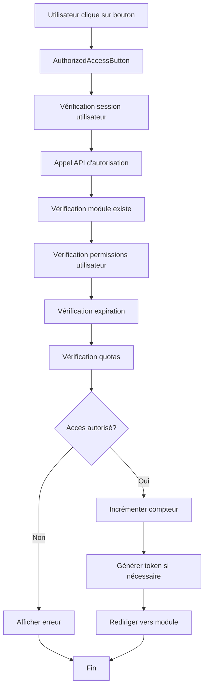

# 🔐 Système d'Autorisation IAHOME

## Vue d'ensemble

Le système d'autorisation IAHOME a été complètement refactorisé pour offrir une gestion centralisée et sécurisée de l'accès aux modules. Il remplace l'ancien système dispersé par une architecture unifiée et robuste.

## 🏗️ Architecture

### Composants principaux

1. **AuthorizationService** (`src/utils/authorizationService.ts`)
   - Service centralisé pour la gestion des autorisations
   - Vérification des permissions utilisateur
   - Gestion des tokens d'accès temporaires
   - Validation des quotas et expirations

2. **AuthorizedAccessButton** (`src/components/AuthorizedAccessButton.tsx`)
   - Composant réutilisable pour les boutons d'accès
   - Gestion automatique de l'autorisation
   - États visuels (chargement, erreur, succès)
   - Intégration avec l'API d'autorisation

3. **UserPermissionsManager** (`src/components/UserPermissionsManager.tsx`)
   - Interface de gestion des permissions utilisateur
   - Affichage des quotas et expirations
   - Hook personnalisé `useUserPermissions`

4. **API d'Autorisation** (`src/app/api/authorize-module-access/route.ts`)
   - Endpoint centralisé pour l'autorisation
   - Actions: check_access, generate_token, increment_usage, validate_token, cleanup_tokens

## 🔧 Fonctionnalités

### Vérification d'Autorisation

```typescript
const authResult = await authorizationService.checkModuleAccess({
  moduleId: 'librespeed',
  moduleTitle: 'LibreSpeed',
  userId: user.id,
  userEmail: user.email
});

if (authResult.authorized) {
  // Accès autorisé
} else {
  // Accès refusé - reason: authResult.reason
}
```

### Gestion des Tokens Temporaires

```typescript
// Génération d'un token (5 minutes)
const token = await authorizationService.generateAccessToken(accessInfo, 5);

// Validation d'un token
const validation = await authorizationService.validateAccessToken(token);
```

### Utilisation du Composant AuthorizedAccessButton

```tsx
<AuthorizedAccessButton
  moduleId="librespeed"
  moduleTitle="LibreSpeed"
  moduleUrl="https://librespeed.iahome.fr"
  onAccessGranted={(url) => window.open(url, '_blank')}
  onAccessDenied={(reason) => alert(`Accès refusé: ${reason}`)}
>
  Accéder à l'application
</AuthorizedAccessButton>
```

## 🛡️ Sécurité

### Vérifications Multiples

1. **Authentification utilisateur** - Vérification de la session Supabase
2. **Existence du module** - Le module doit exister et être visible
3. **Permissions utilisateur** - L'utilisateur doit avoir un accès actif
4. **Expiration** - Vérification de la date d'expiration
5. **Quotas** - Vérification des limites d'utilisation
6. **Origine** - Vérification de l'origine des requêtes

### Tokens Temporaires

- **Durée de vie**: 5 minutes par défaut
- **Usage unique**: Chaque token ne peut être utilisé qu'une fois
- **Nettoyage automatique**: Les tokens expirés sont supprimés
- **Génération sécurisée**: Tokens aléatoires de 32 caractères

## 📊 Gestion des Quotas

### Types de Quotas

1. **Illimité** - `max_usage = 0`
2. **Limité** - `max_usage > 0`
3. **Temporaire** - Avec date d'expiration

### Suivi d'Utilisation

- Compteur automatique à chaque accès
- Vérification avant autorisation
- Interface de visualisation des quotas

## 🔄 Flux d'Autorisation



## 🚀 Déploiement

### Scripts de Déploiement

1. **Test du système**:
   ```powershell
   .\test-authorization-system.ps1
   ```

2. **Déploiement en production**:
   ```powershell
   .\deploy-authorization-system.ps1
   ```

### Vérifications Post-Déploiement

- [ ] API d'autorisation accessible
- [ ] Composants AuthorizedAccessButton fonctionnels
- [ ] Tokens temporaires générés correctement
- [ ] Validation des permissions utilisateur
- [ ] Gestion des quotas opérationnelle

## 📝 Intégration

### Pages Modifiées

1. **`/modules`** - Liste des modules avec autorisation
2. **`/encours`** - Modules en cours avec vérification
3. **`/card/[id]`** - Détail des modules avec autorisation

### API Endpoints

- `POST /api/authorize-module-access` - Actions d'autorisation
- `GET /api/check-auth` - Vérification d'authentification (LibreSpeed)

## 🔍 Debugging

### Logs Importants

```typescript
console.log('🔐 Vérification d\'autorisation pour le module:', moduleTitle);
console.log('✅ Accès autorisé pour le module:', moduleTitle);
console.log('❌ Accès refusé:', reason);
console.log('🔑 Génération d\'un token temporaire pour LibreSpeed...');
```

### Tests de Validation

```bash
# Test de l'API d'autorisation
curl -X POST https://iahome.fr/api/authorize-module-access \
  -H "Content-Type: application/json" \
  -d '{"moduleId":"librespeed","moduleTitle":"LibreSpeed","userId":"test","userEmail":"test@example.com","action":"check_access"}'
```

## 🎯 Avantages

### Pour les Développeurs

- **Code centralisé** - Une seule source de vérité pour l'autorisation
- **Composants réutilisables** - AuthorizedAccessButton utilisable partout
- **API unifiée** - Endpoint centralisé pour toutes les vérifications
- **TypeScript** - Typage strict pour éviter les erreurs

### Pour les Utilisateurs

- **Expérience cohérente** - Même comportement sur toutes les pages
- **Messages d'erreur clairs** - Feedback précis sur les refus d'accès
- **Gestion des quotas** - Visibilité sur l'utilisation des modules
- **Sécurité renforcée** - Vérifications multiples et tokens temporaires

### Pour l'Administration

- **Monitoring centralisé** - Logs unifiés pour le debugging
- **Gestion des permissions** - Interface de gestion des accès utilisateur
- **Nettoyage automatique** - Suppression des tokens expirés
- **Scalabilité** - Architecture prête pour la croissance

## 🔮 Évolutions Futures

### Fonctionnalités Prévues

1. **Audit Trail** - Historique détaillé des accès
2. **Notifications Push** - Alertes sur les expirations
3. **API GraphQL** - Interface plus flexible
4. **Cache Redis** - Amélioration des performances
5. **Rate Limiting** - Protection contre les abus

### Optimisations

1. **Lazy Loading** - Chargement à la demande des permissions
2. **Batch Operations** - Traitement groupé des vérifications
3. **CDN Integration** - Mise en cache des composants statiques
4. **WebSocket** - Mise à jour temps réel des permissions

## 📞 Support

Pour toute question ou problème avec le système d'autorisation :

1. Vérifier les logs de l'application
2. Exécuter le script de test
3. Consulter la documentation API
4. Contacter l'équipe de développement

---

**Version**: 1.0.0  
**Dernière mise à jour**: Janvier 2025  
**Auteur**: Équipe IAHOME
