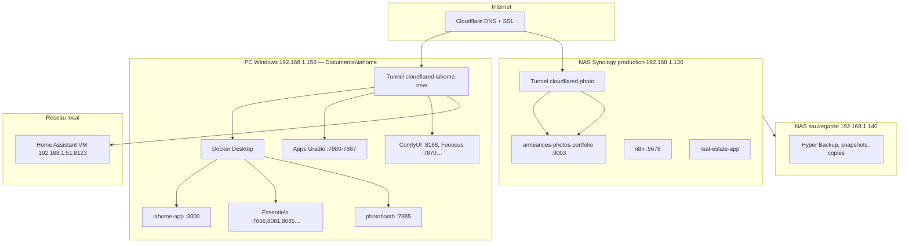

# Architecture numérique Régis Pailler à travers ses 2 plateformes ambiancesphotos.fr et iahome.fr et sous-domaines regispailler.fr — Guide complet

> **Résumé —** Guide complet de reprise : écosystème numérique de Régis Pailler via iahome.fr (commercial), ambiancesphotos.fr (portfolio photo) et les sous-domaines regispailler.fr (domotique, immo, n8n…), avec infrastructure PC/NAS/Cloudflare, Bitwarden et catalogues page par page.


Documentation de reprise pour comprendre, exploiter, modifier et faire évoluer l'écosystème hébergé sur le **PC Windows** (`192.168.1.150`), le **NAS Synology** production (`192.168.1.130`) et le **NAS de sauvegarde** (`192.168.1.140`).


> **Ce tableau** : Les trois plateformes publiques et leur URL : iahome (commercial), ambiancesphotos (portfolio), ha.regispailler (domotique).
| Plateforme | URL |
|------------|-----|
| iahome.fr | https://iahome.fr |
| ambiancesphotos.fr | https://ambiancesphotos.fr |
| ha.regispailler.fr | https://ha.regispailler.fr |

**Dépôts** : `C:\Users\AAA\Documents\iahome` · `C:\Users\AAA\Documents\ambiancesphotos`

## Table des matières

> **Résumé —** Index cliquable : Partie I infrastructure (ch. 01–07), Partie II catalogues (ch. 7–9), liens admin 7.13.


### Partie I — Infrastructure (chapitres 01 à 07)

> **Résumé —** Sommaire cliquable : chapitres 01–07 (infrastructure, Bitwarden, opérations).


- **Ch. 01** — [Vue d'ensemble de l'architecture](#sec-01-vue-ensemble)
- **Ch. 02** — [Plateforme iahome.fr](#sec-02-iahome)
- **Ch. 03** — [Plateforme ambiancesphotos.fr](#sec-03-ambiancesphotos)
- **Ch. 04** — [Sous-domaines regispailler.fr](#sec-04-regispailler)
- **Ch. 05** — [Secrets et accès sécurisé](#sec-05-secrets)
- **Ch. 06** — [Bitwarden — Mise en place](#sec-06-bitwarden)
- **Ch. 07** — [Opérations courantes](#sec-07-operations)


### Partie II — Catalogues de pages (chapitres 7 à 9)

> **Résumé —** Sommaire cliquable : catalogues page par page (numérotation 7, 8, 9 — distincte des ch. 01–07).


- **Ch. 7** — [Catalogue iahome.fr — pages et admin](#sec-07-pages-iahome)
  - [7.1 Vitrine](#sec-71-vitrine) · [7.3 Modules (Essentiels / IA)](#sec-73-modules-detail) · [7.6 Compte](#sec-76-compte) · [7.7 Tarifs](#sec-77-tarifs) · [7.13 Admin](#sec-713-admin)
- **Ch. 8** — [Catalogue ambiancesphotos.fr](#sec-08-pages-ambiancesphotos)
  - [8.1 Accueil](#sec-81-accueil) · [8.2 Guide mariage](#sec-82-guide-mariage) · [8.3 Portfolio](#sec-83-portfolio) · [8.5 Privé](#sec-85-prive) · [8.6 Admin photo](#sec-86-admin-photo)
- **Ch. 9** — [Catalogue Home Assistant & regispailler.fr](#sec-09-pages-ha)
  - [9.A ha.regispailler.fr](#sec-9a-ha) · [9.B Ressources HA iahome](#sec-9b-ha-ressources)


### Admin iahome.fr (détail — section 7.13)

> **Résumé —** Liens rapides vers les 17 écrans admin documentés en 7.13.x (dashboard, users, Stripe, contenu…).


- [7.13.1 Dashboard](#sec-7131-dashboard) · [7.13.2 Utilisateurs](#sec-7132-users) · [7.13.3 Applications](#sec-7133-applications)
- [7.13.4 Paiements](#sec-7134-payments) · [7.13.7 Contenu](#sec-7137-content) · [7.13.9 Campagnes](#sec-7139-campaigns)

---

<a id="sec-01-vue-ensemble"></a>


# 01 — Vue d’ensemble de l’architecture

> **Résumé —** Carte d’ensemble : flux Internet → Cloudflare Tunnel → PC ou NAS ; rôles du PC Windows, du Synology, de la VM Home Assistant et de la station IA ; fichiers YAML et credentials essentiels.


## Schéma global

> **Résumé —** Diagramme Mermaid : Internet → Cloudflare → PC 192.168.1.150 / NAS prod 130 / NAS sauvegarde 140 / VM HA 51.




---


## Rôle de chaque machine

> **Résumé —** Qui fait quoi : PC 192.168.1.150 (iahome + tunnel), NAS prod 130 (photo, n8n), NAS sauvegarde 140, VM HA 51.


### PC Windows (`192.168.1.150`) — poste principal de développement et production iahome

> **Résumé —** PC `192.168.1.150` : iahome.fr (Docker), tunnel Cloudflare `iahome-new`, apps Gradio, ComfyUI/Fooocus, dépôt Git `Documents\iahome`.


- **IP LAN** : `192.168.1.150`
- Héberge **iahome.fr** et la majorité des sous-domaines `*.iahome.fr`
- Exécute **Docker Desktop** avec les conteneurs de production
- Fait tourner le **tunnel Cloudflare** `iahome-new` (fichier `cloudflare-active-config.yml`)
- Sert aussi certaines apps **hors Docker** (Gradio Python, ComfyUI :8188, RuinedFooocus :7870, CogStudio :8080, serveur statique Home Assistant ressources)
- Dépôt Git principal : `C:\Users\AAA\Documents\iahome`


### NAS Synology production (`192.168.1.130`)

> **Résumé —** NAS prod `192.168.1.130` : portfolio photo :9003, n8n :5678, immo, SMB `\\192.168.1.130\docker\`, DSM :5000.


- Héberge le **portfolio photo** (ambiancesphotos / photo.regispailler.fr) — port **9003**
- Héberge **n8n** (automatisations) — port **5678**
- Peut héberger des stacks iahome secondaires (`/volume1/docker/iahome`, `/volume1/docker/immo`)
- Accès admin : **DSM** sur http://192.168.1.130:5000
- Partage réseau SMB : `\\192.168.1.130\docker\`


### NAS Synology de sauvegarde (`192.168.1.140`)

> **Résumé —** NAS sauvegarde `192.168.1.140` : Hyper Backup, snapshots et copies depuis le NAS prod — DSM http://192.168.1.140:5000.


- **IP LAN** : `192.168.1.140`
- Rôle **sauvegarde** : réception des jobs Hyper Backup depuis le NAS `192.168.1.130`
- Peut héberger des **copies** de volumes Docker, photos et exports Bitwarden
- Accès admin : **DSM** sur http://192.168.1.140:5000
- Partage réseau SMB (si configuré) : `\\192.168.1.140\` — vérifier les partages actifs dans DSM


### VM Home Assistant (`192.168.1.51`)

> **Résumé —** VM domotique `192.168.1.51:8123` — instance réelle HA, exposée via `ha.regispailler.fr`, distincte du site ressources iahome.


- Instance **Home Assistant** réelle (domotique maison)
- Exposée publiquement via `ha.regispailler.fr` → tunnel Cloudflare → `192.168.1.51:8123`
- **Distincte** de `homeassistant.iahome.fr` (site de ressources / codes YAML sur le PC)


---


## Exposition Internet : Cloudflare Tunnel

> **Résumé —** Pas de port forwarding box : cloudflared sur PC, fichiers YAML, credentials hors Git.


Les services ne sont **pas** ouverts directement sur la box (pas de port forwarding classique). Tout passe par **Cloudflare Tunnel** (`cloudflared`).


> **Ce tableau** : Référence ligne par ligne — lire chaque entrée pour URL, port, fichier ou action associée.
| Tunnel | Fichier config | Machine qui l’exécute |
|--------|----------------|----------------------|
| `iahome-new` | `iahome\cloudflare-active-config.yml` | PC Windows |
| Portfolio photo | `ambiancesphotos\cloudflared\config-photo-regispailler.yml` | PC Windows (service système, proxy vers NAS :9003) |

Credentials tunnel (ne jamais committer) :
- PC utilisateur : `C:\Users\AAA\.cloudflared\02a960c5-edd6-4b3f-844f-410b16247262.json`
- Service Windows photo : `C:\Windows\System32\config\systemprofile\.cloudflared\` (même ID tunnel)

Dashboard Cloudflare : https://one.dash.cloudflare.com/

> **Attention** : la configuration du dashboard Zero Trust peut **écraser** le fichier YAML local. Vérifier avec `scripts\verifier-config-cloudflare.ps1`.

---


## Couches logicielles sur le PC

> **Résumé —** Stack PC : cloudflared → Traefik → Docker Compose + processus Python natifs (Gradio, HA ressources).


> **Ce tableau** : Référence ligne par ligne — lire chaque entrée pour URL, port, fichier ou action associée.
| Couche | Rôle |
|--------|------|
| **Cloudflare Tunnel** | Entrée publique HTTPS |
| **Traefik** (`iahome-traefik`, ports 80/443/8080) | Reverse proxy local, certificats Let's Encrypt, routes `*.regispailler.fr` vers NAS |
| **Docker Compose** (`docker-compose.prod.yml`) | Stack principale iahome |
| **Services natifs** | Gradio, Node dev, serveur HA statique (:8123) |

Traefik est utile surtout pour les domaines `regispailler.fr` pointant vers le NAS ou `host.docker.internal`.

---


## Adresses IP de référence

> **Résumé —** IPs LAN fixes : PC 192.168.1.150, NAS prod 130, NAS sauvegarde 140, HA 51 — repères SSH, SMB et tunnel.


|----|------------|
| `192.168.1.150` | PC Windows (production iahome, tunnel, apps IA locales) |
| `192.168.1.130` | NAS Synology production (portfolio, n8n, immo) |
| `192.168.1.140` | NAS Synology sauvegarde (Hyper Backup, snapshots) |
| `192.168.1.51` | VM Home Assistant |
| `127.0.0.1` / `localhost` | Services sur le PC (équivalent local sans passer par l’IP LAN) |

---


## Fichiers de configuration clés

> **Résumé —** Chemins prioritaires : `cloudflare-active-config.yml`, compose Docker, `.env`, Traefik dynamic.


> **Ce tableau** : Référence ligne par ligne — lire chaque entrée pour URL, port, fichier ou action associée.
| Fichier | Description |
|---------|-------------|
| `iahome\cloudflare-active-config.yml` | Routes tunnel iahome + ha.regispailler.fr |
| `iahome\docker-compose.prod.yml` | Stack prod PC |
| `iahome\traefik\dynamic\*.yml` | Routes Traefik (45 fichiers) |
| `iahome\.env.production.local` | Secrets prod iahome (hors Git) |
| `ambiancesphotos\docker-compose.synology.yml` | Stack portfolio NAS |
| `ambiancesphotos\cloudflared\config-photo-regispailler.yml` | Tunnel photo |

---


<a id="sec-02-iahome"></a>


# 02 — Plateforme iahome.fr

> **Résumé —** Plateforme commerciale IAHome : site Next.js + Supabase + Stripe, conteneurs Docker sur le PC, sous-domaines applicatifs (Gradio, photobooth, essentiels), tunnel `iahome-new` et commandes de déploiement.


## À qui sert cette plateforme ?

> **Résumé —** Audiences iahome.fr : visiteurs anonymes (vitrine, tarifs), clients abonnés Stripe (Space IA), organisateurs d’événements (photobooth), formateurs (Apprendre autrement) et administrateur (panneau `/admin`).


**iahome.fr** est la plateforme commerciale et technique d’**IAHome** :

- **Clients finaux** : accès à des applications IA (transcription, génération d’images, PDF+IA, photobooth…) via abonnement ou achat ponctuel (Stripe)
- **Utilisateurs authentifiés** : un compte unique (Supabase) pour débloquer les applications du « Space »
- **Organisateurs d’événements** : photobooth connecté, galeries partagées
- **Formateurs / auteurs** : application « Apprendre autrement »
- **Administrateur** : gestion des modules, tokens, campagnes (voir `docs/ADMINISTRATION_ADMIN.md`)

Site public : **https://iahome.fr**

---


## Où est-elle hébergée ?

> **Résumé —** Carte d’hébergement iahome : conteneur `iahome-app` sur PC (port 3000), Traefik local, Supabase et Stripe en SaaS, tunnel Cloudflare sur le PC — le tableau détaille chaque brique et son emplacement physique ou cloud.


> **Ce tableau** : Où tourne chaque brique iahome : PC (Docker/Traefik), SaaS (Supabase/Stripe), Cloudflare tunnel.
| Composant | Hébergement | Détail |
|-----------|-------------|--------|
| Application principale | **PC Windows** | Conteneur Docker `iahome-app`, port **3000** |
| Fichiers statiques | Image Docker | Dossier `public/` copié au build |
| Base de données / auth | **Cloud Supabase** | Hors PC (SaaS) |
| Paiements | **Stripe** | Webhooks configurés sur domaine regispailler |
| Tunnel public | **Cloudflare** | `cloudflared` sur le PC → `localhost:3000` |
| Reverse proxy local | **Traefik** | Conteneur `iahome-traefik` (ports 80, 443, 8080) |

**Dépôt source** : `C:\Users\AAA\Documents\iahome`

**Compose production** : `docker-compose.prod.yml`

---


## Comment y accéder ?

> **Résumé —** Trois profils d’accès iahome : visiteur (URLs publiques HTTPS), développeur (localhost:3000, Portainer, logs Docker) et opérateur Cloudflare (dashboard, purge cache, script tunnel) — voir les sous-sections et tableaux ci-dessous.


### Accès public (utilisateur)

> **Résumé —** URLs HTTPS accessibles sans authentification iahome : site principal, tarifs, page photobooth découverte, applications sur sous-domaines (photobooth, Apprendre autrement, ressources HA) — point d’entrée visiteur.


> **Ce tableau** : Liens HTTPS visiteur iahome : site, tarifs, photobooth, sous-domaines apps — aucun login requis.
| Ressource | URL |
|-----------|-----|
| Site principal | https://iahome.fr |
| Tarifs / photobooth | https://iahome.fr/pricing2 |
| Page photobooth découverte | https://iahome.fr/photobooth-decouverte.html |
| Photobooth app | https://photobooth.iahome.fr |
| Apprendre autrement | https://apprendre-autrement.iahome.fr |
| Ressources Home Assistant | https://homeassistant.iahome.fr |


### Accès développeur / admin (local)

> **Résumé —** Accès depuis le PC de dev uniquement (LAN) : Next.js direct sur :3000, dashboard Traefik :8080, Portainer :9002, logs `iahome-app` — à utiliser avant/après un déploiement pour valider localement.


> **Ce tableau** : Accès dev PC : Next.js :3000, Traefik :8080, Portainer :9002, commande logs Docker.
| Ressource | URL |
|-----------|-----|
| App Next.js (direct) | http://localhost:3000 |
| Traefik dashboard | http://localhost:8080 |
| Portainer (gestion Docker PC) | http://localhost:9002 · https://portainer.iahome.fr |
| Logs conteneur | `docker logs -f iahome-app` |


### Accès Cloudflare

> **Résumé —** Outils opérateur pour iahome : dashboard Zero Trust, purge cache via API locale ou script, vérification du tunnel `iahome-new` — attention le dashboard peut écraser le YAML local.


- Dashboard : https://one.dash.cloudflare.com/
- Purge cache (API locale) : `POST http://localhost:3000/api/purge-cloudflare-cache`
- Script vérification tunnel : `.\scripts\verifier-config-cloudflare.ps1`

---


## Conteneurs Docker principaux (PC)

> **Résumé —** Conteneurs cœur du stack iahome sur Docker Desktop : application Next.js, Traefik, bases et services annexes — référence pour `docker ps`, redémarrage ciblé et lecture des logs.


Fichier : `docker-compose.prod.yml`


> **Ce tableau** : Conteneurs iahome PC : nom Docker, port mappé, rôle (app, proxy, essentiels).
| Conteneur | Port hôte | Rôle |
|-----------|-----------|------|
| `iahome-app` | 3000 | Site Next.js production |
| `apprendre-autrement` | 127.0.0.1:9001 | App pédagogique |
| `iahome-traefik` | 80, 443, 8080 | Reverse proxy |
| `iahome-portainer` | 9002 | Interface Docker |
| `iahome-vote` | 7890 | Vote en ligne |

### Services « essentiels » (compose séparé)

Fichier : `docker-services\essentiels\docker-compose.yml`


> **Ce tableau** : Conteneurs iahome PC : nom Docker, port mappé, rôle (app, proxy, essentiels).
| Conteneur | Port | URL publique |
|-----------|------|--------------|
| `qrcodes-iahome` | 7006 | https://qrcodes.iahome.fr |
| `librespeed-iahome` | 8085 | https://librespeed.iahome.fr |
| `metube-iahome` | 8081 | https://metube.iahome.fr |
| `n8n-iahome` | 5678 | (copie locale ; prod n8n = NAS) |
| `stirling-pdf-iahome` | 8086 | https://pdf.iahome.fr |
| `psitransfer-iahome` | 8087 | https://psitransfer.iahome.fr |

### Autres services (compose ou scripts dédiés)


> **Ce tableau** : Conteneurs iahome PC : nom Docker, port mappé, rôle (app, proxy, essentiels).
| Service | Conteneur / process | Port | URL |
|---------|---------------------|------|-----|
| Photobooth | `photobooth-iahome` | 7885 | https://photobooth.iahome.fr |
| Whisper | `whisper-webui-prod` | 8093 | https://whisper.iahome.fr |
| Voice isolation | `voice-isolation-service` | 8100 | https://voice-isolation.iahome.fr |
| Meeting reports | nginx Docker | 3050 | https://meeting-reports.iahome.fr |
| Prompt generator | npm / Node | 3002 | https://prompt-generator.iahome.fr |
| Vote | `iahome-vote` | 7890 | (Traefik : vote.iahome.fr) |

### Applications IA Gradio (Python, souvent hors Docker)


> **Ce tableau** : Conteneurs iahome PC : nom Docker, port mappé, rôle (app, proxy, essentiels).
| App | Port | URL |
|-----|------|-----|
| Stable Diffusion | 7880 | https://stablediffusion.iahome.fr |
| PhotoMaker | 7881 | https://photomaker.iahome.fr |
| BiRefNet | 7882 | https://birefnet.iahome.fr |
| Animagine XL | 7883 | https://animaginexl.iahome.fr |
| Florence-2 | 7884 | https://florence2.iahome.fr |
| MuseTalk | 7886 | https://musetalk.iahome.fr |
| ComfyUI | 8188 (`192.168.1.150`, PC) | https://comfyui.iahome.fr |
| RuinedFooocus | 7870 (`192.168.1.150`, PC) | https://ruinedfooocus.iahome.fr |

Démarrage groupé : `.\scripts\start-all-apps.ps1` ou `.\scripts\start-apps-gradio-et-homeassistant.ps1`

---


## Sous-domaines iahome.fr (liste complète tunnel)

> **Résumé —** Table de routage tunnel : chaque sous-domaine public `*.iahome.fr` pointe vers un port local (PC) ou une IP LAN — indispensable pour corriger un 502 ou ajouter une nouvelle route Cloudflare.


Source : `cloudflare-active-config.yml`


> **Ce tableau** : Routage tunnel Cloudflare : sous-domaine public → port local PC ou IP LAN (ex. 192.168.1.51:8123).
| Sous-domaine | Origine locale |
|--------------|----------------|
| iahome.fr, www | localhost:3000 |
| qrcodes | 127.0.0.1:7006 |
| librespeed | localhost:8085 |
| whisper | localhost:8093 |
| psitransfer | localhost:8087 |
| metube | localhost:8081 |
| pdf | localhost:8086 |
| photomaker | 127.0.0.1:7881 |
| birefnet | 127.0.0.1:7882 |
| animaginexl | 127.0.0.1:7883 |
| florence2 | 127.0.0.1:7884 |
| stablediffusion | 127.0.0.1:7880 |
| comfyui | 192.168.1.150:8188 |
| ruinedfooocus | 192.168.1.150:7870 |
| cogstudio | 192.168.1.150:8080 |
| meeting-reports | localhost:3050 |
| hunyuan3d | localhost:8888 |
| homeassistant | localhost:8123 |
| apprendre-autrement | 127.0.0.1:9001 |
| prompt-generator | 127.0.0.1:3002 |
| voice-isolation | localhost:8100 |
| portainer | localhost:9002 |
| photobooth, www.photobooth | 127.0.0.1:7885 |

> `homeassistant.iahome.fr` sert le dossier `essentiels\codes-ha` via `python -m http.server 8123` — ce n’est **pas** l’instance domotique.

---


## Déploiement et modification

> **Résumé —** Workflow de publication iahome : édition code/`public/`, rebuild image Docker, redémarrage conteneur, purge cache Cloudflare — commandes PowerShell prêtes à copier selon l’ampleur du changement.


### Modifier le site (pages, images statiques)

1. Éditer dans `public/` ou le code `src/`
2. Pour les fichiers statiques seuls (ex. `public/photobooth-decouverte.html`) :
   ```powershell
   cd C:\Users\AAA\Documents\iahome
   docker compose -f docker-compose.prod.yml build iahome-app
   docker compose -f docker-compose.prod.yml up -d --force-recreate iahome-app
   ```
3. Purger Cloudflare : `POST http://localhost:3000/api/purge-cloudflare-cache`

### Redéploiement complet

```powershell
.\scripts\redeploy-prod-full.ps1
```

Options : `-SkipCloudflare`, `-SkipBuild`

### Démarrage simple (sans rebuild)

```powershell
.\scripts\start-iahome.ps1
```

### Photobooth seul

```powershell
cd photobooth
.\rebuild.ps1
```

---


## Variables d’environnement

> **Résumé —** Fichiers `.env` (valeurs Bitwarden) : Supabase, Stripe, Cloudflare, apps.


Fichier principal (hors Git) : `.env.production.local`

Contient notamment : clés Stripe, Supabase, Cloudflare API, Resend, URLs internes.

Guide : `docs/STRIPE-CLES-DOCKER.md`, `docs/CONFIGURATION_STRIPE_KEYS.md`

---


## Documentation liée

> **Résumé —** Renvois `docs/` du dépôt iahome pour approfondir un sujet technique.


> **Ce tableau** : Référence ligne par ligne — lire chaque entrée pour URL, port, fichier ou action associée.
| Sujet | Fichier |
|-------|---------|
| Ajouter une app au Space | `docs/GUIDE-AJOUT-APPLICATIONS-SPACES.md` |
| Apps Gradio | `docs/APPS-IA-GRADIO.md` |
| Photobooth manuel | `docs/photobooth-manuel-utilisateur/` |
| Admin | `docs/ADMINISTRATION_ADMIN.md` |
| Monitoring local | `docs/MONITOR-LOCALHOST.md` |

---


<a id="sec-03-ambiancesphotos"></a>


# 03 — Plateforme ambiancesphotos.fr

> **Résumé —** Portfolio photo professionnel : stack Docker sur le NAS (Nginx, API, MySQL), source éditée sur le PC puis synchronisée, tunnel Cloudflare depuis le PC vers le port 9003, workflows albums/mariages/galerie privée.


## À qui sert cette plateforme ?

> **Résumé —** Audiences ambiancesphotos : prospects (vitrine, albums publics), futurs mariés (guide mariage), clients avec galerie privée (mot de passe), et le photographe (admin portfolio, contact Resend).


**ambiancesphotos.fr** (alias **photo.regispailler.fr**) est le **site portfolio photographique** de Régis Pailler :

- **Prospects / visiteurs** : découverte des prestations (mariage, portrait, événements), albums publics, guide mariage
- **Clients** : galeries privées (mariages), accès protégé par mot de passe
- **Mariés** : portfolio dédié (ex. Stéphanie & David), version IA optionnelle
- **Contact** : formulaire envoyé par email (Resend)

URLs publiques :
- **https://ambiancesphotos.fr**
- **https://www.ambiancesphotos.fr**
- **https://photo.regispailler.fr** (alias technique, même site)

---


## Où est-elle hébergée ?

> **Résumé —** Hébergement hybride : site/API/MySQL sur NAS Synology (port 9003), édition des photos et HTML sur le PC, tunnel Cloudflare exécuté sur le PC en proxy vers le NAS — ne jamais éditer les photos directement sur le NAS.


> **Ce tableau** : Répartition portfolio : NAS (site/API/MySQL), PC (source photos/HTML), PC (tunnel proxy vers NAS).
| Composant | Hébergement |
|-----------|-------------|
| Site + API + MySQL | **NAS Synology** `192.168.1.130` |
| Dossier NAS | `/volume1/docker/ambiancesphotos` |
| Port exposé sur le LAN | **9003** (conteneur Nginx) |
| Tunnel Cloudflare | **PC Windows** → proxy vers `192.168.1.130:9003` |
| Source de vérité (photos, HTML) | **PC** : `C:\Users\AAA\Documents\ambiancesphotos` |

> **Règle importante** : les photos se **modifient sur le PC**, puis se **synchronisent vers le NAS**. Ne pas éditer les fichiers photo directement sur le NAS pour mettre à jour le site.

---


## Architecture Docker (NAS)

> **Résumé —** Stack Synology `docker-compose.synology.yml` : Nginx frontend (9003), API Node (9308), MySQL (9306), phpMyAdmin (9307) — noms de conteneurs pour SSH NAS et `docker logs`.


Fichier : `docker-compose.synology.yml` (projet `ambiancesphotos`)


> **Ce tableau** : Conteneurs NAS portfolio : Nginx public 9003, API 9308, MySQL 9306, phpMyAdmin 9307.
| Conteneur | Port NAS | Rôle |
|-----------|----------|------|
| `ambiances-photos-portfolio` | **9003→80** | Frontend Nginx (site statique + albums) |
| `portfolio-api` | 9308→3000 | API Node.js (contact, auth galerie privée) |
| `portfolio-mysql` | 9306→3306 | Base MySQL |
| `portfolio-phpmyadmin` | 9307→80 | Admin BDD (usage interne) |

---


## Comment y accéder ?

> **Résumé —** Accès portfolio : visiteurs (ambiancesphotos.fr et alias), technicien (DSM, SSH, SMB, ports LAN 9003/9306–9308) et opérateur tunnel photo (YAML cloudflared sur PC) — trois sous-sections ci-dessous.


### Public

> **Résumé —** Pages portfolio ouvertes à tous : accueil, guide mariage, exemples portfolios mariage (Stéphanie & David), version IA et page de connexion galerie privée — URLs canoniques ambiancesphotos.fr.


> **Ce tableau** : Pages portfolio publiques : accueil, guide mariage, portfolios exemple, login galerie privée.
| Page | URL |
|------|-----|
| Accueil | https://ambiancesphotos.fr |
| Guide mariage client | https://ambiancesphotos.fr/guide-mariage.html |
| Portfolio mariage (exemple) | https://ambiancesphotos.fr/mariage/stephanie-david.html |
| Portfolio IA (exemple) | https://ambiancesphotos.fr/mariage/stephanie-david-ia.html |
| Galerie privée | https://ambiancesphotos.fr/private/login.html |

### Administration / technique

> **Résumé —** Accès maintenance portfolio : DSM Synology, partage SMB, SSH NAS, site/API/phpMyAdmin en LAN (:9003, :9307–9308), logs conteneur Nginx — réservé au photographe ou au successeur technique.


> **Ce tableau** : Accès maintenance : DSM, SMB, SSH NAS, ports LAN site/API/BDD, commande logs conteneur Nginx.
| Ressource | Accès |
|-----------|-------|
| NAS DSM | http://192.168.1.130:5000 |
| Partage SMB photos | `\\192.168.1.130\docker\ambiancesphotos` |
| SSH NAS | `ssh admin@192.168.1.130` |
| Site en local (LAN) | http://192.168.1.130:9003 |
| phpMyAdmin (LAN) | http://192.168.1.130:9307 |
| API (LAN) | http://192.168.1.130:9308 |
| Logs portfolio | `docker logs -f ambiances-photos-portfolio` (sur NAS) |

### Cloudflare (tunnel photo)

> **Résumé —** Tunnel photo exécuté sur le PC Windows : fichier YAML cloudflared, script `retablir-tunnel-photo.ps1`, domaines routés (ambiancesphotos.fr, photo.regispailler.fr) vers NAS :9003.


- Config : `C:\Users\AAA\Documents\ambiancesphotos\cloudflared\config-photo-regispailler.yml`
- Script restauration tunnel : `.\retablir-tunnel-photo.ps1` (admin, depuis le dossier ambiancesphotos)
- Domaines routés : `photo.regispailler.fr`, `ambiancesphotos.fr`, `www.ambiancesphotos.fr` → `http://192.168.1.130:9003`

---


## Structure du projet (PC)

> **Résumé —** Arborescence `C:\Users\AAA\Documents\ambiancesphotos` : HTML/CSS/JS, scripts de build albums, dossier `photos/` source de vérité avant copie SMB ou script vers le NAS.


```
C:\Users\AAA\Documents\ambiancesphotos\
├── index.html, styles.css, script.js    # Site vitrine
├── guide-mariage.html
├── photos/                              # SOURCE DE VÉRITÉ des images
├── mariage/                             # Portfolios clients
├── private/                             # Galerie privée
├── backend/                             # API Node.js
├── nginx.conf                           # Config Nginx (obligatoire sur NAS)
├── docker-compose.synology.yml
├── build-albums.js                      # Génère albums-config.js
├── build-mariage-portfolio.js           # Manifeste portfolio mariage
├── deploy-mariage-photos.ps1            # Sync photos mariage → NAS
└── DEPLOIEMENT-NAS-PHOTO-REGISPAILLER.md  # Guide détaillé NAS
```

---


## Workflow de modification

> **Résumé —** Enchaînement selon le type de changement : photos d’album (`build-albums.js`), portfolio mariage (`build-mariage-portfolio.js` + deploy), HTML/CSS (copie NAS + restart), cache Cloudflare.


### Ajouter / modifier des photos d’albums généraux

1. Copier les fichiers dans `photos\` sur le **PC**
2. Régénérer les manifestes :
   ```powershell
   cd C:\Users\AAA\Documents\ambiancesphotos
   node build-albums.js
   ```
3. Synchroniser vers le NAS (SMB, SCP ou script de déploiement)
4. Redémarrer le conteneur portfolio si `nginx.conf` a changé :
   ```bash
   ssh admin@192.168.1.130
   cd /volume1/docker/ambiancesphotos
   sudo docker compose -f docker-compose.synology.yml restart portfolio
   ```

### Portfolio mariage (ex. Stéphanie-David)

```powershell
cd C:\Users\AAA\Documents\ambiancesphotos
node build-mariage-portfolio.js          # ou build-mariage-portfolio-ia.js
.\deploy-mariage-photos.ps1              # sync /MIR vers NAS
```

### Modifier le site (HTML/CSS)

1. Éditer sur le PC
2. Copier les fichiers modifiés vers `/volume1/docker/ambiancesphotos/` (même chemins relatifs)
3. Redémarrer `ambiances-photos-portfolio` si nécessaire (volumes montés → souvent immédiat)

### Cache

- Cloudflare peut mettre en cache ; purger depuis le dashboard ou attendre TTL
- Pages mariage : `nginx.conf` peut forcer `no-store` sur `/mariage/`
- Cache-bust manuel : paramètre `?v=YYYYMMDD` dans les URLs

---

## Variables d’environnement (NAS)

Fichier sur NAS : `/volume1/docker/ambiancesphotos/.env`  
Modèle : `.env.synology.example`


> **Ce tableau** : Référence ligne par ligne — lire chaque entrée pour URL, port, fichier ou action associée.
| Variable | Usage |
|----------|-------|
| `RESEND_API_KEY` | Envoi emails formulaire contact |
| `RESEND_FROM_EMAIL` | Ex. `noreply@iahome.fr` (domaine vérifié Resend) |
| `CONTACT_EMAIL` | Destinataire des messages |
| `PRIVATE_GALLERY_PASSWORD` | Accès galerie privée |
| `PRIVATE_GALLERY_CODE` | Code galerie |
| `OPENAI_API_KEY` | Assistant IA (optionnel) |

---


## Ne pas confondre

> **Résumé —** Pièges fréquents : ports, dossiers PC vs NAS, ha.regispailler vs homeassistant.iahome.


> **Ce tableau** : Référence ligne par ligne — lire chaque entrée pour URL, port, fichier ou action associée.
| Ce projet | Autre projet |
|-----------|--------------|
| **photo.regispailler.fr** / **ambiancesphotos.fr** | **resas.regispailler.fr** (réservation consoles, port 5000 PC) |
| Port **9003** | Port **5000** = interface DSM Synology (admin NAS) |
| Dossier `ambiancesphotos` | Dossier `iahome` (site IA) |

---


## Documentation liée

> **Résumé —** Renvois `docs/` du dépôt iahome pour approfondir un sujet technique.


- Guide complet NAS : `C:\Users\AAA\Documents\ambiancesphotos\DEPLOIEMENT-NAS-PHOTO-REGISPAILLER.md`
- Email / Resend : voir `backend\email-service.js`

---


<a id="sec-04-regispailler"></a>


# 04 — Sous-domaines regispailler.fr

> **Résumé —** Services personnels ou métier hors marque iahome : domotique HA, immo, n8n, résas, webhooks Stripe — chaque service avec son hébergement (PC, NAS, VM), URL publique et accès LAN documentés.


Le domaine **regispailler.fr** regroupe des services **personnels ou métier**, distincts de la marque commerciale **iahome.fr**. Ils sont exposés via **Cloudflare Tunnel** (PC) et/ou **Traefik** (PC, routage vers NAS ou LAN).

---


## ha.regispailler.fr — Home Assistant (domotique)

> **Résumé —** Home Assistant domotique réelle : VM `192.168.1.51:8123`, exposée via tunnel PC — à ne pas confondre avec `homeassistant.iahome.fr` (site ressources statique sur le PC).


### À qui sert-il ?

> **Résumé —** Usage familial : piloter lumières, capteurs, caméras et automatisations maison depuis le navigateur ou l’app mobile HA, avec accès distant sécurisé sans port forwarding sur la box.


- **Usage personnel / famille** : pilotage domotique (lumières, capteurs, caméras, automatisations)
- **Accès distant sécurisé** sans ouvrir de ports sur la box

### Hébergement

> **Résumé —** Instance sur VM dédiée LAN (`192.168.1.51`, port 8123) ; le PC exécute cloudflared qui proxy le trafic public vers cette IP — pas de HA installé sur le PC pour ce service.


> **Ce tableau** : Détail technique ha.regispailler.fr : composant, IP/port, fichier config Traefik ou tunnel.
| Élément | Détail |
|---------|--------|
| Instance | **VM Home Assistant** sur le réseau local |
| IP | `192.168.1.51` |
| Port | **8123** |
| Tunnel | `cloudflare-active-config.yml` (PC) → `http://192.168.1.51:8123` |

### Accès

> **Résumé —** Public HTTPS `ha.regispailler.fr` (Cloudflare) ou direct LAN `http://192.168.1.51:8123` — identifiants dans Bitwarden collection `Home Assistant`.


> **Ce tableau** : URLs d’accès ha.regispailler.fr : publique Cloudflare vs LAN direct pour debug.
| Type | URL |
|------|-----|
| Public (via Cloudflare) | https://ha.regispailler.fr |
| Local (LAN) | http://192.168.1.51:8123 |

### ⚠️ Distinction importante

> **Résumé —** Comparaison critique : `ha.regispailler.fr` = domotique live sur VM ; `homeassistant.iahome.fr` = pages HTML/YAML de documentation sur le PC — source fréquente de confusion 502.


> **Ce tableau** : Différence critique entre instance HA live (VM) et site ressources statique (PC).
| URL | Nature |
|-----|--------|
| **ha.regispailler.fr** | Instance Home Assistant **réelle** (VM) |
| **homeassistant.iahome.fr** | Site **statique** de ressources (codes YAML, manuel) sur le **PC** port 8123 — dossier `essentiels\codes-ha` |

Ne jamais confondre les deux lors d’un dépannage 502.

---


## immo.regispailler.fr — Recherche immobilière

> **Résumé —** Module recherche immobilière (real-estate) : stack Docker sur NAS `/volume1/docker/immo`, routé par Traefik — peut servir usage perso ou démo produit iahome.


### À qui sert-il ?

> **Résumé —** Consultation et gestion d’annonces immobilières : recherche, carte, fiches biens — module lié au catalogue iahome « real-estate ».


- Application de **recherche / annonces immobilières** (module iahome « real-estate »)
- Peut servir un usage perso ou démo produit

### Hébergement

> **Résumé —** Conteneur `real-estate-app` sur NAS Synology, configuration Traefik `traefik/dynamic/real-estate.yml`, déploiement via `deploy-real-estate.ps1` depuis le dépôt iahome.


> **Ce tableau** : Détail technique immo.regispailler.fr : composant, IP/port, fichier config Traefik ou tunnel.
| Élément | Détail |
|---------|--------|
| Stack | Docker sur **NAS** |
| Dossier NAS | `/volume1/docker/immo` |
| Conteneur | `real-estate-app` |
| Routage | Traefik `traefik/dynamic/real-estate.yml` |

### Accès

> **Résumé —** Public `https://immo.regispailler.fr` ; déploiement et debug depuis le PC avec les scripts iahome documentés dans `docs/DEPLOY_REAL_ESTATE.md`.


> **Ce tableau** : URLs d’accès immo.regispailler.fr : publique Cloudflare vs LAN direct pour debug.
| Type | URL |
|------|-----|
| Public | https://immo.regispailler.fr |
| Déploiement | `.\deploy-real-estate.ps1` depuis iahome |

Documentation : `docs/DEPLOY_REAL_ESTATE.md`, `docs/REAL_ESTATE_QUICK_START.md`

---


## n8n.regispailler.fr — Automatisations

> **Résumé —** Plateforme d’automatisation n8n sur NAS (port 5678) : webhooks, sync, notifications — usage admin/technique, routé par Traefik depuis le PC.


### À qui sert-il ?

> **Résumé —** Création de workflows automatisés (webhooks Stripe, sync données, alertes) — interface réservée à l’administrateur technique.


- **Workflows d’automatisation** (webhooks, sync, notifications, tâches planifiées)
- Usage admin / technique

### Hébergement

> **Résumé —** Service n8n dans `/volume1/docker/n8n` sur NAS, port 5678, proxy Traefik `traefik/dynamic/n8n.yml` vers `192.168.1.130:5678`.


> **Ce tableau** : Détail technique n8n.regispailler.fr : composant, IP/port, fichier config Traefik ou tunnel.
| Élément | Détail |
|---------|--------|
| Service | **n8n** sur **NAS** |
| Port NAS | **5678** |
| Dossier | `/volume1/docker/n8n` |
| Routage | Traefik `traefik/dynamic/n8n.yml` → `192.168.1.130:5678` |

### Accès

> **Résumé —** Public `https://n8n.regispailler.fr` ou LAN `http://192.168.1.130:5678` — identifiants et workflows documentés dans `docs/INSTALLATION-N8N-NAS.md`.


> **Ce tableau** : URLs d’accès n8n.regispailler.fr : publique Cloudflare vs LAN direct pour debug.
| Type | URL |
|------|-----|
| Public | https://n8n.regispailler.fr |
| Local NAS | http://192.168.1.130:5678 |

Documentation : `docs/INSTALLATION-N8N-NAS.md`, `docs/CLOUDFLARE-N8N-SETUP.md`, dépannage `docs/FIX-N8N-*.md`

---


## resas.regispailler.fr — Réservation consoles de jeux

> **Résumé —** Application de réservation de créneaux/consoles : process Node sur PC port 5000, exposée via Traefik — usage familial ou associatif.


### À qui sert-il ?

> **Résumé —** Réservation de consoles de jeux ou créneaux horaires — interface web pour les utilisateurs autorisés, sans lien avec iahome.fr commercial.


- Application de **réservation** (consoles / créneaux) — usage familial ou associatif

### Hébergement

> **Résumé —** Application sur PC Windows port 5000, route Traefik `traefik/dynamic/resas.yml` — vérifier présence de la route dans le tunnel Cloudflare actif.


> **Ce tableau** : Détail technique resas.regispailler.fr : composant, IP/port, fichier config Traefik ou tunnel.
| Élément | Détail |
|---------|--------|
| Machine | **PC Windows** |
| Port | **5000** |
| Routage | Traefik `traefik/dynamic/resas.yml` |

### Accès

> **Résumé —** Public `https://resas.regispailler.fr` ou local `http://127.0.0.1:5000` — contrôler avec `scripts\verifier-config-cloudflare.ps1` si 502.


> **Ce tableau** : URLs d’accès resas.regispailler.fr : publique Cloudflare vs LAN direct pour debug.
| Type | URL |
|------|-----|
| Public | https://resas.regispailler.fr |
| Local | http://127.0.0.1:5000 |

> Vérifier que la route est bien présente dans Cloudflare (`scripts\verifier-config-cloudflare.ps1`) — peut manquer du tunnel actif selon les versions de config.

---


## home.regispailler.fr — Webhooks Stripe

> **Résumé —** Endpoint webhooks Stripe pour abonnements iahome : URL configurée dans le dashboard Stripe, hébergée sur le domaine regispailler (distinct du site vitrine iahome.fr).


### À qui sert-il ?

> **Résumé —** Réception des événements Stripe (paiement réussi, abonnement, annulation) pour mettre à jour les droits utilisateur iahome — service backend, pas de page publique grand public.


- Réception des **webhooks Stripe** pour les abonnements iahome (URL configurée côté Stripe Dashboard)

### Usage documenté

> **Résumé —** URL webhook `https://home.regispailler.fr/api/webhooks/stripe` — dépannage dans `docs/DEBUG_WEBHOOK_STRIPE.md` et `docs/CONFIGURATION_WEBHOOK_STRIPE.md`.


- URL webhook : `https://home.regispailler.fr/api/webhooks/stripe`
- Voir `docs/DEBUG_WEBHOOK_STRIPE.md`, `docs/CONFIGURATION_WEBHOOK_STRIPE.md`

---

## stablediffusion.regispailler.fr

> **Résumé —** Endpoint webhooks Stripe pour abonnements iahome : URL configurée dans le dashboard Stripe, hébergée sur le domaine regispailler (distinct du site vitrine iahome.fr).


- URL alternative référencée dans `.env.local` pour certains services IA
- Peut coexister avec `stablediffusion.iahome.fr` (tunnel PC port 7880)

---

## photo.regispailler.fr

> **Résumé —** Endpoint webhooks Stripe pour abonnements iahome : URL configurée dans le dashboard Stripe, hébergée sur le domaine regispailler (distinct du site vitrine iahome.fr).


- **Alias** du portfolio photo → voir [03 — ambiancesphotos](#sec-03-ambiancesphotos)
- Routé vers NAS `:9003` via tunnel photo séparé

---

## Tableau récapitulatif regispailler.fr

> **Résumé —** Endpoint webhooks Stripe pour abonnements iahome : URL configurée dans le dashboard Stripe, hébergée sur le domaine regispailler (distinct du site vitrine iahome.fr).


> **Ce tableau** : Routage tunnel Cloudflare : sous-domaine public → port local PC ou IP LAN (ex. 192.168.1.51:8123).
| Sous-domaine | Service | Hôte | Port | Config |
|--------------|---------|------|------|--------|
| ha.regispailler.fr | Home Assistant VM | 192.168.1.51 | 8123 | `cloudflare-active-config.yml` |
| immo.regispailler.fr | Immobilier | NAS | 3001 (interne) | `traefik/dynamic/real-estate.yml` |
| n8n.regispailler.fr | n8n | NAS | 5678 | `traefik/dynamic/n8n.yml` |
| resas.regispailler.fr | Réservations | PC | 5000 | `traefik/dynamic/resas.yml` |
| home.regispailler.fr | Webhooks Stripe | (iahome) | 3000 | Stripe Dashboard |
| photo.regispailler.fr | Portfolio photo | NAS | 9003 | `ambiancesphotos/cloudflared/` |
| stablediffusion.regispailler.fr | SD (alt.) | PC / LAN | 7880 | `.env.local` |

---

## Accès admin transverses


> **Ce tableau** : Référence ligne par ligne — lire chaque entrée pour URL, port, fichier ou action associée.
| Outil | URL | Remarque |
|-------|-----|----------|
| Cloudflare Zero Trust | https://one.dash.cloudflare.com/ | Tunnels, DNS, Access |
| Synology DSM | http://192.168.1.130:5000 | Admin NAS — **≠ port 5000 resas sur PC** |
| Portainer NAS | http://192.168.1.130:9000 | Gestion Docker NAS |
| Portainer PC | https://portainer.iahome.fr | Gestion Docker PC |

---


<a id="sec-05-secrets"></a>


# 05 — Secrets et accès sécurisé

> **Résumé —** Emplacements des secrets (sans valeurs), règles de non-commit, inventaire Bitwarden et checklist de passation pour qu’un tiers reprenne l’infrastructure en autonomie.


Ce chapitre explique **où sont stockés les secrets** aujourd’hui et **comment un successeur** peut y accéder de façon sécurisée, **sans** les écrire en clair dans ce dépôt Git.

---


## Principe fondamental

> **Résumé —** Jamais committer secrets ; documenter emplacements ; prévoir passation Bitwarden.


> **Ce tableau** : Référence ligne par ligne — lire chaque entrée pour URL, port, fichier ou action associée.
| ✅ À faire | ❌ À ne jamais faire |
|-----------|---------------------|
| Stocker les mots de passe dans un **coffre-fort** chiffré | Committer des `.env` avec vraies clés dans Git |
| Documenter **l’emplacement** des secrets, pas leur valeur | Envoyer des mots de passe par email ou chat |
| Utiliser des **comptes dédiés** par service | Réutiliser le même mot de passe partout |
| Prévoir un **accès d’urgence** (contact de confiance) | Laisser les secrets uniquement « dans la tête » du propriétaire |

---


## Solution officielle : Bitwarden

> **Résumé —** Coffre retenu : collections par plateforme, accès urgence, export périodique.


**Décision retenue** : tous les secrets de l’architecture sont centralisés dans **Bitwarden** (organisation **Infra Regispailler**).

Guide pas-à-pas avec checklist complète : **[Bitwarden — Mise en place](#sec-06-bitwarden)**


### Pourquoi Bitwarden ?

> **Résumé —** Réception des événements Stripe (paiement réussi, abonnement, annulation) pour mettre à jour les droits utilisateur iahome — service backend, pas de page publique grand public.


- Open source, audité, client sur toutes plateformes
- Partage sécurisé avec une **organisation** (famille, associé, successeur)
- **Accès d’urgence** configurable (délai avant déverrouillage)
- Peut être **auto-hébergé** (Vaultwarden sur le NAS) — option documentée, non retenue pour l’instant

### Mise en place (plan en 5 étapes)

#### 1. Créer le coffre

- Option cloud : https://bitwarden.com (compte premium ou organisation Famille)
- Option auto-hébergée : conteneur **Vaultwarden** sur le NAS (`192.168.1.130`), exposé en LAN ou via Cloudflare Access

#### 2. Structure des entrées (collections)

Créer une collection par plateforme :


> **Ce tableau** : Référence ligne par ligne — lire chaque entrée pour URL, port, fichier ou action associée.
| Collection Bitwarden | Contenu |
|---------------------|---------|
| **IAHome — Production** | Stripe, Supabase, Resend, Cloudflare API, JWT secrets |
| **IAHome — Infra PC** | Compte Windows, Docker Hub (si utilisé), Portainer |
| **NAS Synology** | Admin DSM, SSH, MySQL portfolio, phpMyAdmin |
| **Cloudflare** | Compte admin, token API purge cache, tokens tunnel |
| **Home Assistant** | Compte ha.regispailler.fr, tokens longue durée |
| **Domaines / Email** | Registrar, Resend, boîtes contact |
| **Galeries photo** | Mots de passe galeries privées clients |

#### 3. Pour chaque entrée, renseigner

- **Nom** : ex. `iahome — Stripe Secret Key (prod)`
- **URL** : lien direct vers le dashboard (ex. https://dashboard.stripe.com/apikeys)
- **Identifiant / mot de passe / notes**
- **Champ « Notes »** : chemin du fichier local, ex. `C:\Users\AAA\Documents\iahome\.env.production.local` → variable `STRIPE_SECRET_KEY`
- **Pièce jointe** (optionnel) : export chiffré du `.env` (fichier `.env.enc` hors Git)

#### 4. Accès successeur

- Inviter la personne de confiance dans l’**organisation Bitwarden** avec rôle **Admin** ou activer **Emergency Access** (accès après 7 jours d’inactivité par ex.)
- Documenter dans Bitwarden (note sécurisée) :
  - Emplacement PC : `C:\Users\AAA\Documents\`
  - IP NAS : `192.168.1.130`
  - Lien vers ce guide : `docs/ARCHITECTURE-NUMERIQUE/README.md`

#### 5. Rotation et audit

- Renouveler les clés API sensibles (Stripe webhook, Cloudflare) après transmission du coffre
- Vérifier trimestriellement que Bitwarden est à jour avec les `.env` réels

---

## Complément : Cloudflare Access

Pour Portainer, n8n ou DSM, vous pouvez **en plus** de Bitwarden protéger l’accès web via Cloudflare Access (SSO) — voir dashboard Zero Trust.

---


## Inventaire des secrets (emplacements, pas les valeurs)

> **Résumé —** Liste `.env` et dashboards cloud — noms Bitwarden suggérés.


### PC — iahome


> **Ce tableau** : Référence ligne par ligne — lire chaque entrée pour URL, port, fichier ou action associée.
| Fichier / chemin | Variables sensibles typiques |
|------------------|------------------------------|
| `iahome\.env.production.local` | Stripe, Supabase, Cloudflare, Resend, OpenAI |
| `iahome\.env.local` | Dev, URLs internes |
| `iahome\env.production.local` | Copie pour build Docker (sans point) |
| `C:\Users\AAA\.cloudflared\*.json` | Credentials tunnel Cloudflare |
| `iahome\nginx\.htpasswd` | Basic auth (si activé) |
| `docker-services\essentiels\.env` | JWT QR codes, secrets essentiels |

### PC — ambiancesphotos


> **Ce tableau** : Référence ligne par ligne — lire chaque entrée pour URL, port, fichier ou action associée.
| Fichier | Variables |
|---------|-----------|
| `ambiancesphotos\.env` | Dev local |
| Scripts deploy | Identifiants SMB NAS (session Windows) |

### NAS


> **Ce tableau** : Référence ligne par ligne — lire chaque entrée pour URL, port, fichier ou action associée.
| Fichier | Variables |
|---------|-----------|
| `/volume1/docker/ambiancesphotos/.env` | Resend, OpenAI, galerie privée |
| `/volume1/docker/n8n/.env` ou compose | `N8N_ENCRYPTION_KEY`, auth n8n |
| `/volume1/docker/immo/.env.production` | Supabase, clés immo |
| Compte **admin** DSM | Accès SSH, File Station, Docker |

### Services cloud (dashboards web)


> **Ce tableau** : Référence ligne par ligne — lire chaque entrée pour URL, port, fichier ou action associée.
| Service | URL admin | Secret typique |
|---------|-----------|----------------|
| Stripe | https://dashboard.stripe.com/ | Secret key, webhook secret |
| Supabase | https://supabase.com/dashboard | Service role key, anon key |
| Cloudflare | https://one.dash.cloudflare.com/ | API token, tunnel tokens |
| Resend | https://resend.com/ | API key `re_…` |
| OpenAI | https://platform.openai.com/ | API key |

---

## Accès physiques et réseau à documenter dans Bitwarden


> **Ce tableau** : Secrets Bitwarden : nom entrée, dashboard cloud, variable `.env` ou chemin fichier local.
| Accès | Détail |
|-------|--------|
| PC Windows | Compte session, PIN, BitLocker si activé — IP `192.168.1.150` |
| NAS Synology production | Admin DSM `192.168.1.130`, 2FA si activé |
| NAS Synology sauvegarde | Admin DSM `192.168.1.140`, 2FA si activé |
| Box / réseau | IP LAN, Wi-Fi invité si séparé |
| VM Home Assistant | Console hyperviseur, IP `192.168.1.51` |

---


## Procédure « handover » (passation à un tiers)

> **Résumé —** Checklist ordonnée : accès machines, Bitwarden, dépôts Git, tests smoke.


1. **Lire** ce dossier `ARCHITECTURE-NUMERIQUE/` en entier
2. **Obtenir** l’accès Bitwarden (invitation ou emergency access)
3. **Vérifier** que Docker Desktop tourne sur le PC et que `docker ps` liste les conteneurs iahome
4. **Vérifier** le NAS production : http://192.168.1.130:5000 et conteneur `ambiances-photos-portfolio` ; NAS sauvegarde : http://192.168.1.140:5000
5. **Tester** les URLs publiques : iahome.fr, ambiancesphotos.fr, ha.regispailler.fr
6. **Ne pas** copier les `.env` du PC vers le NAS (secrets différents) — voir `docs/FICHIERS_A_COPIER_NAS.md`
7. **Changer** les mots de passe critiques après la passation (DSM, Bitwarden master, Stripe si compromis)

---

## Fiche modèle Bitwarden (à dupliquer)

```
Titre : [Plateforme] — [Service] — [Prod/Dev]
URL   : https://…
Login : …
Password : …
Notes :
  - Fichier local : C:\Users\AAA\Documents\…\.env.production.local
  - Variable : NOM_VARIABLE
  - Commande test : curl http://localhost:3000/health
  - Doc : docs/ARCHITECTURE-NUMERIQUE/02-plateforme-iahome.md
```

---


<a id="sec-06-bitwarden"></a>


# 06 — Bitwarden — Mise en place (solution officielle)

> **Résumé —** Mise en place pas-à-pas du coffre Bitwarden : collections par plateforme, entrées à créer, accès d’urgence et bonnes pratiques de rotation.


Bitwarden est le **coffre-fort officiel** pour tous les secrets de l’architecture iahome / ambiancesphotos / regispailler.fr.

Ce guide est une **checklist actionnable**. Cochez chaque case au fur et à mesure.

---


## Étape 1 — Créer le compte

> **Résumé —** Actions concrètes Bitwarden à cette étape : création compte, collections, entrées, test accès d’urgence.


1. Aller sur https://bitwarden.com/fr/download/
2. Installer **Bitwarden Desktop** sur le PC Windows
3. Créer un compte avec :
   - Email dédié (ex. `infra@…` ou email principal)
   - **Mot de passe maître fort** (phrase de 4+ mots, 20+ caractères)
   - **Indice** utile mais non révélateur
4. Activer la **2FA** (application authenticator : Bitwarden mobile, Aegis, etc.)
5. Noter la **clé de récupération 2FA** et la stocker **hors ligne** (papier dans un coffre)

> Option premium (~10 €/an) : accès d’urgence, 2FA avancée, rapports. L’organisation Famille permet le partage.

---


## Étape 2 — Créer une organisation

> **Résumé —** Actions concrètes Bitwarden à cette étape : création compte, collections, entrées, test accès d’urgence.


Une organisation permet de **partager** des entrées avec un successeur sans donner le mot de passe maître.

1. Bitwarden → **Organisation** → Créer
2. Nom suggéré : **`Infra Regispailler`**
3. Plan : **Famille** (partage) ou **Free** (solo, pas de partage org)
4. Inviter plus tard la personne de confiance avec rôle **Gestionnaire** ou **Admin**

---


## Étape 3 — Créer les collections

> **Résumé —** Actions concrètes Bitwarden à cette étape : création compte, collections, entrées, test accès d’urgence.


Dans l’organisation, créer ces **collections** :

- [ ] `IAHome — Production`
- [ ] `IAHome — Infra PC`
- [ ] `Ambiances Photos — NAS`
- [ ] `Cloudflare & Tunnels`
- [ ] `NAS Synology`
- [ ] `Home Assistant`
- [ ] `Domaines & Emails`
- [ ] `Clients — Galeries privées`
- [ ] `Documentation — Accès`

---


## Étape 4 — Remplir les entrées (checklist)

> **Résumé —** Actions concrètes Bitwarden à cette étape : création compte, collections, entrées, test accès d’urgence.


Pour chaque entrée : **Nom** · **URL** (dashboard) · **Identifiant** · **Mot de passe / clé API** · **Notes** (fichier `.env` + nom de variable).


### Collection `IAHome — Production`

> **Résumé —** Entrées Bitwarden à créer dans cette collection — une ligne par secret, compte ou clé API avec emplacement fichier local.


> **Ce tableau** : Secrets Bitwarden : nom entrée, dashboard cloud, variable `.env` ou chemin fichier local.
| ☐ | Nom Bitwarden | URL admin | Variable / fichier |
|---|---------------|-----------|-------------------|
| ☐ | iahome — Supabase (projet) | https://supabase.com/dashboard | Compte login ; `NEXT_PUBLIC_SUPABASE_URL`, `NEXT_PUBLIC_SUPABASE_ANON_KEY`, `SUPABASE_SERVICE_ROLE_KEY` → `.env.production.local` |
| ☐ | iahome — Stripe (prod) | https://dashboard.stripe.com/apikeys | `STRIPE_SECRET_KEY`, `NEXT_PUBLIC_STRIPE_PUBLISHABLE_KEY` |
| ☐ | iahome — Stripe Webhook | https://dashboard.stripe.com/webhooks | `STRIPE_WEBHOOK_SECRET` · URL : `https://home.regispailler.fr/api/webhooks/stripe` |
| ☐ | iahome — Resend | https://resend.com/api-keys | `RESEND_API_KEY`, `RESEND_FROM_EMAIL` |
| ☐ | iahome — OpenAI | https://platform.openai.com/api-keys | `OPENAI_API_KEY` |
| ☐ | iahome — JWT / Auth | — | `JWT_SECRET`, `NEXTAUTH_SECRET`, `MAGIC_LINK_SECRET` → `.env.production.local` |
| ☐ | iahome — Cloudflare API | https://one.dash.cloudflare.com/profile/api-tokens | `CLOUDFLARE_API_TOKEN`, `CLOUDFLARE_ZONE_ID`, `CLOUDFLARE_ACCOUNT_ID` |


### Collection `IAHome — Infra PC`

> **Résumé —** Entrées Bitwarden à créer dans cette collection — une ligne par secret, compte ou clé API avec emplacement fichier local.


> **Ce tableau** : Secrets Bitwarden : nom entrée, dashboard cloud, variable `.env` ou chemin fichier local.
| ☐ | Nom Bitwarden | Notes |
|---|---------------|-------|
| ☐ | PC Windows — session | Compte Windows, PIN, BitLocker |
| ☐ | Docker Hub (si utilisé) | Login registry |
| ☐ | Portainer PC | https://portainer.iahome.fr — premier login local |
| ☐ | GitHub / GitLab | Dépôts iahome + ambiancesphotos |
| ☐ | Fichier env principal | Chemin : `C:\Users\AAA\Documents\iahome\.env.production.local` (ne pas committer) |


### Collection `Cloudflare & Tunnels`

> **Résumé —** Entrées Bitwarden à créer dans cette collection — une ligne par secret, compte ou clé API avec emplacement fichier local.


> **Ce tableau** : Secrets Bitwarden : nom entrée, dashboard cloud, variable `.env` ou chemin fichier local.
| ☐ | Nom Bitwarden | Notes |
|---|---------------|-------|
| ☐ | Cloudflare — compte admin | https://one.dash.cloudflare.com/ |
| ☐ | Tunnel iahome-new | Credentials : `C:\Users\AAA\.cloudflared\02a960c5-edd6-4b3f-844f-410b16247262.json` · Config : `iahome\cloudflare-active-config.yml` |
| ☐ | Tunnel portfolio photo | Config : `ambiancesphotos\cloudflared\config-photo-regispailler.yml` · Service Windows `cloudflared` |
| ☐ | Cloudflare Access (si utilisé) | Service tokens, team domain |


### Collection `NAS Synology`

> **Résumé —** Entrées Bitwarden à créer dans cette collection — une ligne par secret, compte ou clé API avec emplacement fichier local.


> **Ce tableau** : Secrets Bitwarden : nom entrée, dashboard cloud, variable `.env` ou chemin fichier local.
| ☐ | Nom Bitwarden | Notes |
|---|---------------|-------|
| ☐ | Synology DSM admin (production) | http://192.168.1.130:5000 · activer 2FA |
| ☐ | Synology DSM admin (sauvegarde) | http://192.168.1.140:5000 · activer 2FA |
| ☐ | SSH NAS | `ssh admin@192.168.1.130` |
| ☐ | SMB docker | `\\192.168.1.130\docker\` |
| ☐ | MySQL portfolio | User `portfolio_user` · compose : `docker-compose.synology.yml` |
| ☐ | phpMyAdmin portfolio | http://192.168.1.130:9307 (LAN) |
| ☐ | n8n NAS | `/volume1/docker/n8n` · `N8N_ENCRYPTION_KEY` |
| ☐ | immo NAS | `/volume1/docker/immo/.env.production` |


### Collection `Ambiances Photos — NAS`

> **Résumé —** Entrées Bitwarden à créer dans cette collection — une ligne par secret, compte ou clé API avec emplacement fichier local.


> **Ce tableau** : Secrets Bitwarden : nom entrée, dashboard cloud, variable `.env` ou chemin fichier local.
| ☐ | Nom Bitwarden | Variable / notes |
|---|---------------|------------------|
| ☐ | portfolio — .env NAS | `/volume1/docker/ambiancesphotos/.env` |
| ☐ | portfolio — Resend | `RESEND_API_KEY`, `RESEND_FROM_EMAIL`, `CONTACT_EMAIL` |
| ☐ | portfolio — Galerie privée | `PRIVATE_GALLERY_CODE`, `PRIVATE_GALLERY_PASSWORD` |
| ☐ | portfolio — JWT | `JWT_SECRET` |
| ☐ | portfolio — OpenAI (optionnel) | `OPENAI_API_KEY` |


### Collection `Home Assistant`

> **Résumé —** Entrées Bitwarden à créer dans cette collection — une ligne par secret, compte ou clé API avec emplacement fichier local.


> **Ce tableau** : Secrets Bitwarden : nom entrée, dashboard cloud, variable `.env` ou chemin fichier local.
| ☐ | Nom Bitwarden | Notes |
|---|---------------|-------|
| ☐ | HA VM — ha.regispailler.fr | Instance réelle · http://192.168.1.51:8123 |
| ☐ | HA VM — hyperviseur | Accès console VM (Proxmox, VirtualBox, etc.) |
| ☐ | homeassistant.iahome.fr | Site ressources statiques PC — pas de login HA |


### Collection `Domaines & Emails`

> **Résumé —** Entrées Bitwarden à créer dans cette collection — une ligne par secret, compte ou clé API avec emplacement fichier local.


> **Ce tableau** : Secrets Bitwarden : nom entrée, dashboard cloud, variable `.env` ou chemin fichier local.
| ☐ | Nom Bitwarden | Notes |
|---|---------------|-------|
| ☐ | Registrar iahome.fr | OVH, Gandi, Cloudflare Registrar… |
| ☐ | Registrar regispailler.fr | |
| ☐ | Registrar ambiancesphotos.fr | |
| ☐ | Email contact / formateur | Boîtes utilisées dans Resend / CONTACT_EMAIL |


### Collection `Clients — Galeries privées`

> **Résumé —** Entrées Bitwarden à créer dans cette collection — une ligne par secret, compte ou clé API avec emplacement fichier local.


Créer **une entrée par client** (mariage, portrait) :

```
Nom : Galerie — [Nom client] — [Année]
Notes : URL https://ambiancesphotos.fr/private/… · code ou mot de passe · date livraison
```


### Collection `Documentation — Accès`

> **Résumé —** Entrées Bitwarden à créer dans cette collection — une ligne par secret, compte ou clé API avec emplacement fichier local.


Une entrée **Secure Note** (note sécurisée) :

```
Titre : Architecture numérique — point d'entrée
Notes :
  Guide : C:\Users\AAA\Documents\iahome\docs\ARCHITECTURE-NUMERIQUE\README.md
  PC projets : C:\Users\AAA\Documents\iahome , C:\Users\AAA\Documents\ambiancesphotos
  PC IP : 192.168.1.150
  NAS production : 192.168.1.130
  NAS sauvegarde : 192.168.1.140
  HA VM : 192.168.1.51
  Redéploiement iahome : .\scripts\redeploy-prod-full.ps1
  Redéploiement photo : ambiancesphotos\deploy-mariage-photos.ps1
```

---


## Étape 5 — Accès d’urgence (successeur)

> **Résumé —** Actions concrètes Bitwarden à cette étape : création compte, collections, entrées, test accès d’urgence.


1. Bitwarden → **Paramètres** → **Accès d’urgence**
2. Inviter la personne de confiance (email Bitwarden)
3. Délai recommandé : **7 jours** (le contact peut demander l’accès ; vous avez 7 jours pour refuser)
4. Alternative : invitation directe à l’organisation **Infra Regispailler** en rôle Gestionnaire

---


## Étape 6 — Bonnes pratiques au quotidien

> **Résumé —** Actions concrètes Bitwarden à cette étape : création compte, collections, entrées, test accès d’urgence.


- [ ] Extension navigateur Bitwarden installée (Chrome / Firefox)
- [ ] App mobile synchronisée (accès d’urgence nomade)
- [ ] À chaque nouveau secret dans un `.env` → **créer ou mettre à jour** l’entrée Bitwarden le même jour
- [ ] **Ne jamais** coller de clé API dans un chat, email ou commit Git
- [ ] Audit trimestriel : comparer `.env.production.local` et entrées Bitwarden

---


## Étape 7 — Sauvegarde du coffre

> **Résumé —** Actions concrètes Bitwarden à cette étape : création compte, collections, entrées, test accès d’urgence.


> **Ce tableau** : Quoi sauvegarder, destination (Git, NAS, Bitwarden), fréquence recommandée.
| Méthode | Fréquence |
|---------|-----------|
| Sync Bitwarden cloud (automatique) | Continue |
| Export chiffré Bitwarden (`.json` encrypted) | Mensuel → clé USB dans un coffre |
| Clé maître + clé 2FA recovery | Papier hors ligne |

L’export se fait via : Bitwarden → **Outils** → **Exporter le coffre** → format **chiffré**.

---

## Modèle de note pour une entrée « clé API »

```
Fichier   : C:\Users\AAA\Documents\iahome\.env.production.local
Variable  : STRIPE_SECRET_KEY
Rotation  : 2026-06-XX
Test      : docker logs iahome-app après redéploiement
Doc       : docs/STRIPE-CLES-DOCKER.md
```

---

## Vaultwarden (option avancée — auto-hébergement)

Si vous préférez **ne pas** utiliser le cloud Bitwarden :

- Déployer **Vaultwarden** sur le NAS (conteneur Docker léger)
- Accès LAN uniquement ou via Cloudflare Access
- Compatible avec les clients Bitwarden officiels
- Doc : https://github.com/dani-garcia/vaultwarden

Pour l’instant, le plan retenu est **Bitwarden cloud** + organisation **Infra Regispailler** (plus simple pour la passation).

---


<a id="sec-07-operations"></a>


# 07 — Opérations courantes

> **Résumé —** Commandes et checklists quotidiennes : redémarrer iahome, déployer ambiancesphotos, dépanner Home Assistant, n8n, photobooth et vérifier les tunnels Cloudflare.


Guide pratique pour redémarrer, déployer et dépanner l’architecture sans être le propriétaire initial.

---


## Checklist « le site est down »

> **Résumé —** 6 points : Cloudflare, PC allumé, Docker, tunnel, conteneur, logs.


1. **Internet / Cloudflare** : https://www.cloudflarestatus.com/
2. **PC allumé** et connecté au réseau local
3. **Docker Desktop** démarré (`docker info` doit répondre)
4. **Tunnel cloudflared** actif :
   ```powershell
   Get-Process cloudflared
   # ou
   Get-Service cloudflared
   ```
5. **NAS allumé** (prod `192.168.1.130`, sauvegarde `192.168.1.140`) : ping les deux IP
6. **Conteneurs** : `docker ps` — vérifier `iahome-app`, `photobooth-iahome`, etc.

---


## iahome.fr — Commandes essentielles

> **Résumé —** Commandes PowerShell/bash prêtes à copier : diagnostic, redémarrage, rebuild — adapter selon machine (PC ou NAS).


```powershell
cd C:\Users\AAA\Documents\iahome

# Démarrer sans rebuild
.\scripts\start-iahome.ps1

# Rebuild + redémarrer l'app principale (HTML public, config)
docker compose -f docker-compose.prod.yml build iahome-app
docker compose -f docker-compose.prod.yml up -d --force-recreate iahome-app

# Redéploiement complet (long)
.\scripts\redeploy-prod-full.ps1

# Purger cache Cloudflare
Invoke-RestMethod -Uri "http://localhost:3000/api/purge-cloudflare-cache" -Method POST -ContentType "application/json" -Body "{}"

# Logs
docker logs -f iahome-app

# Vérifier tunnel Cloudflare
.\scripts\verifier-config-cloudflare.ps1
```

### Docker Desktop ne démarre pas

```powershell
# Redémarrer la couche WSL Docker
wsl --terminate docker-desktop
Start-Process "C:\Program Files\Docker\Docker\Docker Desktop.exe"
# Attendre ~30 s puis : docker version
```

### Photobooth

```powershell
cd C:\Users\AAA\Documents\iahome\photobooth
.\rebuild.ps1
# URL : http://localhost:7885 — https://photobooth.iahome.fr
```

### Apps Gradio + HA ressources

```powershell
cd C:\Users\AAA\Documents\iahome
.\scripts\start-apps-gradio-et-homeassistant.ps1
```

---


## ambiancesphotos.fr — Commandes essentielles

> **Résumé —** Commandes PowerShell/bash prêtes à copier : diagnostic, redémarrage, rebuild — adapter selon machine (PC ou NAS).


### Sur le PC (sync)

> **Résumé —** Commandes à lancer sur cette machine : build, sync SMB, docker compose restart/rebuild.


```powershell
cd C:\Users\AAA\Documents\ambiancesphotos

# Régénérer albums
node build-albums.js

# Portfolio mariage
node build-mariage-portfolio.js
.\deploy-mariage-photos.ps1

# Copie manuelle vers NAS (exemple)
Copy-Item -Recurse -Force .\photos \\192.168.1.130\docker\ambiancesphotos\photos
Copy-Item -Force .\index.html, .\styles.css \\192.168.1.130\docker\ambiancesphotos\
```


### Sur le NAS (SSH)

> **Résumé —** Commandes à lancer sur cette machine : build, sync SMB, docker compose restart/rebuild.


```bash
ssh admin@192.168.1.130
cd /volume1/docker/ambiancesphotos

# État
sudo docker ps

# Redémarrer le site
sudo docker compose -f docker-compose.synology.yml restart portfolio

# Rebuild complet
sudo docker compose -f docker-compose.synology.yml build --no-cache portfolio api
sudo docker compose -f docker-compose.synology.yml up -d

# Logs
sudo docker logs -f ambiances-photos-portfolio
sudo docker logs -f portfolio-api
```

### Tunnel photo (PC, admin)

```powershell
cd C:\Users\AAA\Documents\ambiancesphotos
.\retablir-tunnel-photo.ps1
```

---


## ha.regispailler.fr — Dépannage

> **Résumé —** Home Assistant domotique réelle : VM `192.168.1.51:8123`, exposée via tunnel PC — à ne pas confondre avec `homeassistant.iahome.fr` (site ressources statique sur le PC).


> **Ce tableau** : Dépannage : symptôme observé → action corrective immédiate.
| Symptôme | Action |
|----------|--------|
| 502 via Cloudflare | Vérifier VM HA : http://192.168.1.51:8123 depuis le LAN |
| VM éteinte | Redémarrer la VM sur l’hyperviseur |
| Tunnel OK mais HA lent | Redémarrer Home Assistant depuis son interface |

Ressources statiques (autre service) :
- `homeassistant.iahome.fr` → redémarrer serveur Python port 8123 sur **PC**
- Voir `docs/FIX-502-HOMEASSISTANT.md`

---


## n8n.regispailler.fr — Dépannage rapide

> **Résumé —** Plateforme d’automatisation n8n sur NAS (port 5678) : webhooks, sync, notifications — usage admin/technique, routé par Traefik depuis le PC.


```bash
ssh admin@192.168.1.130
cd /volume1/docker/n8n
sudo docker compose ps
sudo docker compose restart
```

Documentation extended : `docs/FIX-N8N-502-*.md`, `docs/INSTALLATION-N8N-NAS.md`

---


## Ports de référence (PC)

> **Résumé —** Ports LAN à tester (`curl`, navigateur) ou à renseigner dans Cloudflare/Traefik — différencier PC vs NAS.


> **Ce tableau** : Port LAN → service associé : tester avec navigateur ou `curl` depuis le PC.
| Port | Service |
|------|---------|
| 3000 | iahome-app |
| 7885 | photobooth |
| 8123 | HA ressources statiques (PC) |
| 9002 | Portainer PC |
| 8080 | Traefik dashboard |
| 5678 | n8n local (copie) |
| 7006 | qrcodes |
| 8081 | metube |
| 8085 | librespeed |
| 8086 | pdf |
| 8087 | psitransfer |
| 8093 | whisper |
| 8100 | voice-isolation |


## Ports de référence (NAS)

> **Résumé —** Ports LAN à tester (`curl`, navigateur) ou à renseigner dans Cloudflare/Traefik — différencier PC vs NAS.


> **Ce tableau** : Port LAN → service associé : tester avec navigateur ou `curl` depuis le PC.
| Port | Service |
|------|---------|
| 5000 | DSM (admin Synology) |
| 9003 | Portfolio photo public |
| 5678 | n8n production |
| 9306 | MySQL portfolio |
| 9307 | phpMyAdmin |
| 9308 | API portfolio |

---


## Sauvegardes recommandées

> **Résumé —** Git, Bitwarden export, snapshots NAS, dossier photos PC.


> **Ce tableau** : Quoi sauvegarder, destination (Git, NAS, Bitwarden), fréquence recommandée.
| Quoi | Où | Fréquence |
|------|-----|-----------|
| Dépôts Git iahome + ambiancesphotos | GitHub / GitLab | À chaque changement |
| Photos originales | PC + copie NAS + disque externe | Hebdo |
| `.env` chiffrés | Bitwarden + export KeePass offline | Mensuel |
| Volumes Docker NAS | Snapshot Synology `192.168.1.130` + Hyper Backup vers NAS `192.168.1.140` | Quotidien |
| Credentials Cloudflare | Bitwarden | À chaque rotation |

---

## Qui contacter / quelle doc ouvrir


> **Ce tableau** : Problème type → document `docs/` ou section guide à consulter en premier.
| Problème | Document |
|----------|----------|
| Paiements Stripe | `docs/DEBUG_WEBHOOK_STRIPE.md` |
| Email contact portfolio | `ambiancesphotos/backend/email-service.js`, Resend dashboard |
| NAS inaccessible | `docs/NAS-TROUBLESHOOTING.md` |
| Ajouter une app iahome | `docs/GUIDE-AJOUT-APPLICATIONS-SPACES.md` |
| Immo | `docs/DEPLOY_REAL_ESTATE.md` |

---


<a id="sec-07-pages-iahome"></a>


# 7. Catalogue des pages — iahome.fr

> **Résumé —** Inventaire exhaustif iahome.fr : vitrine (7.1), catalogues modules (7.2–7.3), compte Supabase (7.6), Stripe (7.7), pages statiques (7.11), redirections (7.12) et panneau admin 7.13 (17 écrans).


> **Légende accès** : 🌐 Public · 🔐 Compte requis · 🪙 Compte + crédits/tokens · 🔑 Lien magique (`?token=`) · 🛡️ Admin

**URL de base** : https://iahome.fr  
**Code source pages** : `src/app/` (Next.js) + `public/` (HTML statique)

---

<a id="sec-71-vitrine"></a>


## 7.1. Pages vitrine et navigation

> **Résumé —** Pages marketing publiques sans login : accueil, argumentaire B2B, avantages, à propos, contact, FAQ, inscription — toutes servies par Next.js sous `src/app/`.


### 7.1.1. Accueil — `/`

> **Résumé —** Fiche **Accueil** (`/`) : URL publique, niveau d’accès (public/auth/admin), rôle métier — Landing principale : modules mis en avant, CTA inscription/tarifs, SEO — fichier `src/app/page.tsx`.


> **Ce tableau** : Fiche page iahome : URL, icône accès (public/auth/admin), rôle utilisateur, chemin fichier source Next.js ou `public/`.
| | |
|---|---|
| **URL** | https://iahome.fr/ |
| **Accès** | 🌐 Public |
| **Rôle** | Page d’entrée de la plateforme : présentation IAHome, modules mis en avant, appels à l’action (inscription, tarifs) |
| **Modifier** | `src/app/page.tsx`, composants home, images `public/images/` |


### 7.1.2. Marketing — `/marketing`

> **Résumé —** Fiche **Marketing** (`/marketing`) : URL publique, niveau d’accès (public/auth/admin), rôle métier — Argumentaire B2B entreprises : cas d’usage IA en équipe — page `/marketing`.


> **Ce tableau** : Fiche page iahome : URL, icône accès (public/auth/admin), rôle utilisateur, chemin fichier source Next.js ou `public/`.
| | |
|---|---|
| **URL** | https://iahome.fr/marketing |
| **Accès** | 🌐 Public |
| **Rôle** | Argumentaire B2B : solutions IA pour entreprises et équipes |
| **Modifier** | `src/app/marketing/page.tsx` |


### 7.1.3. Avantages — `/avantages`

> **Résumé —** Fiche **Avantages** (`/avantages`) : URL publique, niveau d’accès (public/auth/admin), rôle métier — Différenciation IAHome vs concurrence : bénéfices clients — page `/avantages`.


> **Ce tableau** : Fiche page iahome : URL, icône accès (public/auth/admin), rôle utilisateur, chemin fichier source Next.js ou `public/`.
| | |
|---|---|
| **URL** | https://iahome.fr/avantages |
| **Accès** | 🌐 Public |
| **Rôle** | Pourquoi choisir IAHome (valeur, différenciation) |
| **Modifier** | `src/app/avantages/page.tsx` |


### 7.1.4. À propos — `/about`

> **Résumé —** Fiche **À propos** (`/about`) : URL publique, niveau d’accès (public/auth/admin), rôle métier — Mission, vision, histoire du projet — page `/about`.


> **Ce tableau** : Fiche page iahome : URL, icône accès (public/auth/admin), rôle utilisateur, chemin fichier source Next.js ou `public/`.
| | |
|---|---|
| **URL** | https://iahome.fr/about |
| **Accès** | 🌐 Public |
| **Rôle** | Mission, vision, présentation du projet |
| **Modifier** | `src/app/about/page.tsx` |


### 7.1.5. Contact — `/contact`

> **Résumé —** Fiche **Contact** (`/contact`) : URL publique, niveau d’accès (public/auth/admin), rôle métier — Formulaire ou coordonnées contact commercial — page `/contact`.


> **Ce tableau** : Fiche page iahome : URL, icône accès (public/auth/admin), rôle utilisateur, chemin fichier source Next.js ou `public/`.
| | |
|---|---|
| **URL** | https://iahome.fr/contact |
| **Accès** | 🌐 Public |
| **Rôle** | Formulaire ou coordonnées support / partenariats |
| **Modifier** | `src/app/contact/page.tsx` |


### 7.1.6. Communauté — `/community`

> **Résumé —** Fiche **Communauté** (`/community`) : URL publique, niveau d’accès (public/auth/admin), rôle métier et fichier source à modifier.


> **Ce tableau** : Fiche page iahome : URL, icône accès (public/auth/admin), rôle utilisateur, chemin fichier source Next.js ou `public/`.
| | |
|---|---|
| **URL** | https://iahome.fr/community |
| **Accès** | 🌐 Public |
| **Rôle** | Espace communautaire, entraide autour de l’IA |
| **Modifier** | `src/app/community/page.tsx` |


### 7.1.7. Recherche — `/search`

> **Résumé —** Fiche **Recherche** (`/search`) : URL publique, niveau d’accès (public/auth/admin), rôle métier et fichier source à modifier.


> **Ce tableau** : Fiche page iahome : URL, icône accès (public/auth/admin), rôle utilisateur, chemin fichier source Next.js ou `public/`.
| | |
|---|---|
| **URL** | https://iahome.fr/search |
| **Accès** | 🌐 Public |
| **Rôle** | Recherche transversale sur le site (modules, contenus) |
| **Modifier** | `src/app/search/page.tsx` |

---


## 7.2. Catalogues et hubs d’applications

> **Résumé —** Pages listant les modules IA (`/applications`, `/essentiels`) : grilles de cartes menant aux fiches `/card/*` et aux sous-domaines applicatifs — hub principal du « Space » utilisateur.


### 7.2.1. Applications IA — `/applications`

> **Résumé —** Fiche **Applications IA** (`/applications`) : URL publique, niveau d’accès (public/auth/admin), rôle métier et fichier source à modifier.


> **Ce tableau** : Fiche page iahome : URL, icône accès (public/auth/admin), rôle utilisateur, chemin fichier source Next.js ou `public/`.
| | |
|---|---|
| **URL** | https://iahome.fr/applications |
| **Accès** | 🌐 Public (enrichi si connecté) |
| **Rôle** | Catalogue complet des applications IA disponibles sur la plateforme |
| **Modifier** | `src/app/applications/page.tsx` |


### 7.2.2. Essentiels — `/essentiels`

> **Résumé —** Fiche **Essentiels** (`/essentiels`) : URL publique, niveau d’accès (public/auth/admin), rôle métier — Hub outils « essentiels » (Metube, PDF, QR…) — liens vers sous-domaines ou routes proxy.


> **Ce tableau** : Fiche page iahome : URL, icône accès (public/auth/admin), rôle utilisateur, chemin fichier source Next.js ou `public/`.
| | |
|---|---|
| **URL** | https://iahome.fr/essentiels |
| **Accès** | 🌐 Public |
| **Rôle** | Hub des services « essentiels » : PDF, QR codes, LibreSpeed, MeTube, Home Assistant, Vote, Sentinelle… |
| **Modifier** | `src/app/essentiels/page.tsx` |


### 7.2.3. Mes modules — `/modules`

> **Résumé —** Fiche **Mes modules** (`/modules`) : URL publique, niveau d’accès (public/auth/admin), rôle métier et fichier source à modifier.


> **Ce tableau** : Fiche page iahome : URL, icône accès (public/auth/admin), rôle utilisateur, chemin fichier source Next.js ou `public/`.
| | |
|---|---|
| **URL** | https://iahome.fr/modules |
| **Accès** | 🔐 Compte requis |
| **Rôle** | Liste des modules activés pour l’utilisateur connecté |
| **Modifier** | `src/app/modules/page.tsx` |


### 7.2.4. Fiche module dynamique — `/card/[id]`

> **Résumé —** Fiche **Fiche module dynamique** (`/card/[id]`) : URL publique, niveau d’accès (public/auth/admin), rôle métier et fichier source à modifier.


> **Ce tableau** : Fiche page iahome : URL, icône accès (public/auth/admin), rôle utilisateur, chemin fichier source Next.js ou `public/`.
| | |
|---|---|
| **URL** | https://iahome.fr/card/{id} (ex. `/card/cogstudio`) |
| **Accès** | 🌐 Consultation · 🪙 Lancement application |
| **Rôle** | Fiche produit générique pour les modules sans page dédiée |
| **Modifier** | `src/app/card/[id]/page.tsx` |

---


## 7.3. Fiches modules — `/card/*`

> **Résumé —** 29 fiches `/card/*` + §7.3.A–C : classification Essentiels vs Applications IA, caractéristiques, tokens et fichier MODULES-IAHOME-CATALOGUE.md.


Chaque fiche décrit une application, ses fonctionnalités et le bouton d’accès (consomme des crédits).


> **Ce tableau** : 29 modules IAHome : chemin fiche `/card/*`, nom app, sous-domaine ou hébergement Gradio/Docker.
| N° | Chemin | Application | Sous-domaine / hébergement |
|----|--------|-------------|----------------------------|
| 7.3.1 | `/card/whisper` | Transcription audio/vidéo | whisper.iahome.fr |
| 7.3.2 | `/card/stablediffusion` | Génération d’images SD | stablediffusion.iahome.fr |
| 7.3.3 | `/card/ruinedfooocus` | Génération Fooocus | ruinedfooocus.iahome.fr |
| 7.3.4 | `/card/comfyui` | Workflows ComfyUI | comfyui.iahome.fr |
| 7.3.5 | `/card/photomaker` | Portraits IA PhotoMaker | photomaker.iahome.fr |
| 7.3.6 | `/card/birefnet` | Détourage / fond | birefnet.iahome.fr |
| 7.3.7 | `/card/animagine-xl` | Images anime/manga | animaginexl.iahome.fr |
| 7.3.8 | `/card/florence-2` | Vision-language (OCR, caption) | florence2.iahome.fr |
| 7.3.9 | `/card/hunyuan3d` | Modèle 3D Hunyuan | hunyuan3d.iahome.fr |
| 7.3.10 | `/card/hi3dgen` | Image → 3D (UI intégrée) | iahome.fr (intégré) |
| 7.3.11 | `/card/musetalk` | Lip-sync vidéo | musetalk.iahome.fr |
| 7.3.12 | `/card/photo-vivante` | Animation photo | photo-vivante.iahome.fr |
| 7.3.13 | `/card/pdf` | PDF+ manipulation / Q&R | pdf.iahome.fr |
| 7.3.14 | `/card/voice-isolation` | Isolation vocale Demucs | voice-isolation.iahome.fr |
| 7.3.15 | `/card/meeting-reports` | Comptes rendus réunion | meeting-reports.iahome.fr |
| 7.3.16 | `/card/prompt-generator` | Générateur de prompts | prompt-generator.iahome.fr |
| 7.3.17 | `/card/qrcodes` | QR codes dynamiques | qrcodes.iahome.fr |
| 7.3.18 | `/card/librespeed` | Test de débit | librespeed.iahome.fr |
| 7.3.19 | `/card/metube` | Téléchargement YouTube | metube.iahome.fr |
| 7.3.20 | `/card/psitransfer` | Transfert fichiers | psitransfer.iahome.fr |
| 7.3.21 | `/card/home-assistant` | Ressources domotique | homeassistant.iahome.fr |
| 7.3.22 | `/card/photobooth` | Photobooth événementiel | photobooth.iahome.fr |
| 7.3.23 | `/card/apprendre-autrement` | Activités enfants | apprendre-autrement.iahome.fr |
| 7.3.24 | `/card/vote` | Vote en ligne | vote.iahome.fr |
| 7.3.25 | `/card/ai-detector` | Détecteur contenu IA | iahome.fr/ai-detector |
| 7.3.26 | `/card/sentinelle-numerique` | Cybersécurité personnelle | iahome.fr/sentinelle-numerique |
| 7.3.27 | `/card/code-learning` | Apprendre à coder (6–14 ans) | iahome.fr/code-learning |
| 7.3.28 | `/card/administration` | Annuaire démarches France | iahome.fr/administration |
| 7.3.29 | `/card/cogstudio` | Vidéo CogStudio | cogstudio.iahome.fr (via `[id]`) |

**Modifier une fiche** : `src/app/card/{nom-module}/page.tsx`

---

<a id="sec-73-modules-detail"></a>

### 7.3.A. Classification site — Essentiels vs Applications IA

> **Résumé —** Découpage menu iahome : `/essentiels` (12 modules pratiques, `essentialModules`) vs `/applications` (IA GPU).


> **Ce tableau** : 29 modules IAHome : chemin fiche `/card/*`, nom app, sous-domaine ou hébergement Gradio/Docker.
| Hub | URL | Rôle |
|-----|-----|------|
| **Outils essentiels** | https://iahome.fr/essentiels | PDF, QR, MeTube, Photobooth, Vote, domotique ressources… — voir §7.3.B |
| **Applications IA** | https://iahome.fr/applications | Whisper, Stable Diffusion, ComfyUI, MuseTalk… — voir §7.3.C |

**Coûts tokens** : `src/utils/tokenActionService.ts` (`TOKEN_COSTS`). **Catalogue complet** (tableaux détaillés) : [MODULES-IAHOME-CATALOGUE.md](./MODULES-IAHOME-CATALOGUE.md).

---

### 7.3.B. Outils essentiels — caractéristiques (sans IA générative)

> **Résumé —** Photobooth, LibreSpeed, MeTube, PDF, QR, Vote… — hub Essentiels, tokens 10/100, Docker ou Next.js.


> **Ce tableau** : 29 modules IAHome : chemin fiche `/card/*`, nom app, sous-domaine ou hébergement Gradio/Docker.
| Module | Fiche | App | Caractéristiques | Tokens |
|--------|-------|-----|------------------|--------|
| Photobooth | `/card/photobooth` | photobooth.iahome.fr | Selfies/vidéos événement, PIN, galerie, QR | 100 |
| LibreSpeed | `/card/librespeed` | librespeed.iahome.fr | Test débit et latence Internet | 10 |
| MeTube | `/card/metube` | metube.iahome.fr | Téléchargement YouTube / MP3 | 10 |
| PsiTransfer | `/card/psitransfer` | psitransfer.iahome.fr | Transfert fichiers volumineux | 10 |
| PDF+ | `/card/pdf` | pdf.iahome.fr | Manipulation PDF (fusion, split, sign…) | 10 |
| QR Codes | `/card/qrcodes` | qrcodes.iahome.fr | QR dynamiques + statistiques scans | 100 |
| Code Learning | `/card/code-learning` | iahome.fr/code-learning | Initiation programmation 6–14 ans | 10 |
| Apprendre autrement | `/card/apprendre-autrement` | apprendre-autrement.iahome.fr | Activités adaptées, badges | 10 |
| Home Assistant | `/card/home-assistant` | homeassistant.iahome.fr | Ressources YAML (≠ VM `ha.regispailler.fr`) | 100 |
| Administration | `/card/administration` | iahome.fr/administration | Annuaire démarches France | 10 |
| Vote | `/card/vote` | vote.iahome.fr | Sondages PIN / QR | 10 |
| Sentinelle Numérique | `/card/sentinelle-numerique` | iahome.fr/sentinelle-numerique | Cybersécurité, fin de vie numérique | 10 |

**Doc client Photobooth** : `docs/photobooth-manuel-utilisateur/` (même inventaire, ton utilisateur).

---

### 7.3.C. Applications IA — caractéristiques

> **Résumé —** Whisper, SD, ComfyUI, MuseTalk, 3D… — hub Applications, Gradio/GPU, tunnel Cloudflare.


> **Ce tableau** : 29 modules IAHome : chemin fiche `/card/*`, nom app, sous-domaine ou hébergement Gradio/Docker.
| Module | Fiche | App | Caractéristiques | Tokens |
|--------|-------|-----|------------------|--------|
| Whisper | `/card/whisper` | whisper.iahome.fr | Transcription audio/vidéo, sous-titres, OCR | 100 |
| Stable Diffusion | `/card/stablediffusion` | stablediffusion.iahome.fr | Génération images texte→image | 100 |
| RuinedFooocus | `/card/ruinedfooocus` | ruinedfooocus.iahome.fr | Images IA (Fooocus) | 100 |
| ComfyUI | `/card/comfyui` | comfyui.iahome.fr | Workflows image avancés | 100 |
| PhotoMaker | `/card/photomaker` | photomaker.iahome.fr | Portraits IA | 100 |
| BiRefNet | `/card/birefnet` | birefnet.iahome.fr | Détourage / fond | 100 |
| Animagine XL | `/card/animagine-xl` | animaginexl.iahome.fr | Images anime / manga | 100 |
| Florence-2 | `/card/florence-2` | florence2.iahome.fr | Vision + langage, caption, OCR | 100 |
| Hunyuan3D | `/card/hunyuan3d` | hunyuan3d.iahome.fr | Modèles 3D | 100 |
| Hi3DGen | `/card/hi3dgen` | iahome.fr (intégré) | Image → 3D | selon fiche |
| MuseTalk | `/card/musetalk` | musetalk.iahome.fr | Lip-sync vidéo | 100 |
| Photo vivante | `/card/photo-vivante` | photo-vivante.iahome.fr | Animation photo | 100 |
| Isolation vocale | `/card/voice-isolation` | voice-isolation.iahome.fr | Séparation pistes Demucs | 100 |
| Meeting Reports | `/card/meeting-reports` | meeting-reports.iahome.fr | CR réunion IA | 100 |
| Générateur prompts | `/card/prompt-generator` | prompt-generator.iahome.fr | Prompt engineering LLM | 100 |
| Détecteur IA | `/card/ai-detector` | iahome.fr/ai-detector | Détection contenu IA | 100 |
| CogStudio | `/card/cogstudio` | cogstudio.iahome.fr | Génération vidéo IA | 10 |

**Ports / conteneurs** : voir ch. 02 § conteneurs Docker et sous-domaines tunnel ; détail hébergement par module dans [MODULES-IAHOME-CATALOGUE.md](./MODULES-IAHOME-CATALOGUE.md).

---


Pages applicatives hébergées directement sur iahome.fr (sans sous-domaine).


### 7.4.1. Détecteur IA — `/ai-detector`

> **Résumé —** Fiche **Détecteur IA** (`/ai-detector`) : URL publique, niveau d’accès (public/auth/admin), rôle métier et fichier source à modifier.


> **Ce tableau** : Fiche page iahome : URL, icône accès (public/auth/admin), rôle utilisateur, chemin fichier source Next.js ou `public/`.
| | |
|---|---|
| **URL** | https://iahome.fr/ai-detector |
| **Accès** | 🌐 Public |
| **Rôle** | Analyse texte et image pour détecter du contenu généré par IA |
| **Modifier** | `src/app/ai-detector/page.tsx` |


### 7.4.2. Sentinelle numérique — `/sentinelle-numerique`

> **Résumé —** Fiche **Sentinelle numérique** (`/sentinelle-numerique`) : URL publique, niveau d’accès (public/auth/admin), rôle métier et fichier source à modifier.


> **Ce tableau** : Fiche page iahome : URL, icône accès (public/auth/admin), rôle utilisateur, chemin fichier source Next.js ou `public/`.
| | |
|---|---|
| **URL** | https://iahome.fr/sentinelle-numerique |
| **Accès** | 🌐 Public |
| **Rôle** | Guide et outils cybersécurité / fin de vie numérique |
| **Modifier** | `src/app/sentinelle-numerique/page.tsx` |


### 7.4.3. Code Learning — `/code-learning`

> **Résumé —** Fiche **Code Learning** (`/code-learning`) : URL publique, niveau d’accès (public/auth/admin), rôle métier et fichier source à modifier.


> **Ce tableau** : Fiche page iahome : URL, icône accès (public/auth/admin), rôle utilisateur, chemin fichier source Next.js ou `public/`.
| | |
|---|---|
| **URL** | https://iahome.fr/code-learning |
| **Accès** | 🌐 Public |
| **Rôle** | Parcours programmation pour enfants 6–14 ans |
| **Modifier** | `src/app/code-learning/page.tsx` |


### 7.4.4. Administration (annuaire services publics) — `/administration`

> **Résumé —** Fiche **Administration (annuaire services publics)** (`/administration`) : URL publique, niveau d’accès (public/auth/admin), rôle métier et fichier source à modifier.


> **Ce tableau** : Fiche page iahome : URL, icône accès (public/auth/admin), rôle utilisateur, chemin fichier source Next.js ou `public/`.
| | |
|---|---|
| **URL** | https://iahome.fr/administration |
| **Accès** | 🌐 Public |
| **Rôle** | Annuaire des démarches administratives (CAF, impôts, Ameli…) — **≠ panneau admin `/admin`** |
| **Modifier** | `src/app/administration/page.tsx` |

---


## 7.5. Proxys et accès sécurisé aux apps

> **Résumé —** Routes Next.js qui vérifient le JWT Supabase avant de proxyfier vers Gradio ou iframe : mécanisme de contrôle d’accès aux apps payantes du Space.


### 7.5.1. Accès par token — `/access/[token]`

> **Résumé —** Fiche **Accès par token** (`/access/[token]`) : URL publique, niveau d’accès (public/auth/admin), rôle métier et fichier source à modifier.


> **Ce tableau** : Fiche page iahome : URL, icône accès (public/auth/admin), rôle utilisateur, chemin fichier source Next.js ou `public/`.
| | |
|---|---|
| **URL** | https://iahome.fr/access/{token} |
| **Accès** | 🔑 Token JWT dans l’URL |
| **Rôle** | Iframe d’accès module sécurisé après achat ou attribution |
| **Modifier** | `src/app/access/[token]/page.tsx` |


### 7.5.2. Routes proxy Gradio (exemples)

> **Résumé —** Regroupe les pages iahome.fr de **2. Routes proxy Gradio (exemples)** — chaque sous-section 7.x.y détaille URL, accès et fichier source.


> **Ce tableau** : Fiche page iahome : URL, icône accès (public/auth/admin), rôle utilisateur, chemin fichier source Next.js ou `public/`.
| N° | Chemin | Cible |
|----|--------|-------|
| 7.5.2.1 | `/stablediffusion` | Proxy → API Gradio SD |
| 7.5.2.2 | `/whisper` | Proxy Whisper |
| 7.5.2.3 | `/comfyui` | Proxy ComfyUI |
| 7.5.2.4 | `/pdf` | Proxy PDF+ |
| 7.5.2.5 | `/psitransfer` | Proxy PsiTransfer |
| 7.5.2.6 | `/ruinedfooocus` | Proxy Fooocus |
| 7.5.2.7 | `/librespeed-redirect` | Contrôle token → LibreSpeed |

Sans token valide → redirection vers `/login`.

---

<a id="sec-76-compte"></a>


## 7.6. Compte utilisateur et authentification

> **Résumé —** Parcours Supabase Auth : inscription, login, mot de passe oublié, espace « Mon compte », tokens d’accès modules — prérequis pour débloquer les applications.


### 7.6.1. Connexion — `/login`

> **Résumé —** Fiche **Connexion** (`/login`) : URL publique, niveau d’accès (public/auth/admin), rôle métier et fichier source à modifier.


> **Ce tableau** : Fiche page iahome : URL, icône accès (public/auth/admin), rôle utilisateur, chemin fichier source Next.js ou `public/`.
| | |
|---|---|
| **URL** | https://iahome.fr/login |
| **Accès** | 🌐 Public |
| **Rôle** | Authentification Supabase (email/mot de passe) |
| **Modifier** | `src/app/login/page.tsx` |


### 7.6.2. Inscription — `/signup`

> **Résumé —** Fiche **Inscription** (`/signup`) : URL publique, niveau d’accès (public/auth/admin), rôle métier — Création compte Supabase — redirection post-signup vers Space ou tarifs.


> **Ce tableau** : Fiche page iahome : URL, icône accès (public/auth/admin), rôle utilisateur, chemin fichier source Next.js ou `public/`.
| | |
|---|---|
| **URL** | https://iahome.fr/signup |
| **Accès** | 🌐 Public |
| **Rôle** | Création de compte gratuit |
| **Modifier** | `src/app/signup/page.tsx` |


### 7.6.3. Inscription confirmée — `/signup-success`

> **Résumé —** Fiche **Inscription confirmée** (`/signup-success`) : URL publique, niveau d’accès (public/auth/admin), rôle métier et fichier source à modifier.


> **Ce tableau** : Fiche page iahome : URL, icône accès (public/auth/admin), rôle utilisateur, chemin fichier source Next.js ou `public/`.
| | |
|---|---|
| **URL** | https://iahome.fr/signup-success |
| **Accès** | 🌐 Public |
| **Rôle** | Confirmation après inscription |
| **Modifier** | `src/app/signup-success/page.tsx` |


### 7.6.4. Mot de passe oublié — `/forgot-password`

> **Résumé —** Fiche **Mot de passe oublié** (`/forgot-password`) : URL publique, niveau d’accès (public/auth/admin), rôle métier et fichier source à modifier.


> **Ce tableau** : Fiche page iahome : URL, icône accès (public/auth/admin), rôle utilisateur, chemin fichier source Next.js ou `public/`.
| | |
|---|---|
| **URL** | https://iahome.fr/forgot-password |
| **Accès** | 🌐 Public |
| **Rôle** | Demande de réinitialisation par email |
| **Modifier** | `src/app/forgot-password/page.tsx` |


### 7.6.5. Réinitialisation — `/reset-password`

> **Résumé —** Fiche **Réinitialisation** (`/reset-password`) : URL publique, niveau d’accès (public/auth/admin), rôle métier et fichier source à modifier.


> **Ce tableau** : Fiche page iahome : URL, icône accès (public/auth/admin), rôle utilisateur, chemin fichier source Next.js ou `public/`.
| | |
|---|---|
| **URL** | https://iahome.fr/reset-password |
| **Accès** | 🔑 Lien email |
| **Rôle** | Saisie du nouveau mot de passe |
| **Modifier** | `src/app/reset-password/page.tsx` |


### 7.6.6. Vérification email — `/verify-email`

> **Résumé —** Fiche **Vérification email** (`/verify-email`) : URL publique, niveau d’accès (public/auth/admin), rôle métier et fichier source à modifier.


> **Ce tableau** : Fiche page iahome : URL, icône accès (public/auth/admin), rôle utilisateur, chemin fichier source Next.js ou `public/`.
| | |
|---|---|
| **URL** | https://iahome.fr/verify-email?token=… |
| **Accès** | 🔑 Token |
| **Rôle** | Validation de l’adresse email |
| **Modifier** | `src/app/verify-email/page.tsx` |


### 7.6.7. Callback OAuth — `/auth/callback`

> **Résumé —** Fiche **Callback OAuth** (`/auth/callback`) : URL publique, niveau d’accès (public/auth/admin), rôle métier et fichier source à modifier.


> **Ce tableau** : Fiche page iahome : URL, icône accès (public/auth/admin), rôle utilisateur, chemin fichier source Next.js ou `public/`.
| | |
|---|---|
| **URL** | https://iahome.fr/auth/callback |
| **Accès** | Flux auth |
| **Rôle** | Retour OAuth Supabase |
| **Modifier** | `src/app/auth/callback/page.tsx` |


### 7.6.8. Réactivation compte — `/reactivate-account`

> **Résumé —** Fiche **Réactivation compte** (`/reactivate-account`) : URL publique, niveau d’accès (public/auth/admin), rôle métier et fichier source à modifier.


> **Ce tableau** : Fiche page iahome : URL, icône accès (public/auth/admin), rôle utilisateur, chemin fichier source Next.js ou `public/`.
| | |
|---|---|
| **URL** | https://iahome.fr/reactivate-account |
| **Accès** | 🔑 Token + email |
| **Rôle** | Réactiver un compte désactivé |
| **Modifier** | `src/app/reactivate-account/page.tsx` |


### 7.6.9. Mon compte — `/account`

> **Résumé —** Fiche **Mon compte** (`/account`) : URL publique, niveau d’accès (public/auth/admin), rôle métier et fichier source à modifier.


> **Ce tableau** : Fiche page iahome : URL, icône accès (public/auth/admin), rôle utilisateur, chemin fichier source Next.js ou `public/`.
| | |
|---|---|
| **URL** | https://iahome.fr/account |
| **Accès** | 🔐 Compte requis |
| **Rôle** | Profil, applications activées, paramètres utilisateur |
| **Modifier** | `src/app/account/page.tsx` |


### 7.6.10. Mes crédits — `/my-tokens`

> **Résumé —** Fiche **Mes crédits** (`/my-tokens`) : URL publique, niveau d’accès (public/auth/admin), rôle métier et fichier source à modifier.


> **Ce tableau** : Fiche page iahome : URL, icône accès (public/auth/admin), rôle utilisateur, chemin fichier source Next.js ou `public/`.
| | |
|---|---|
| **URL** | https://iahome.fr/my-tokens |
| **Accès** | 🌐 (CTA login si anonyme) |
| **Rôle** | Solde de crédits / tokens |
| **Modifier** | `src/app/my-tokens/page.tsx` |


### 7.6.11. Portfolio photo perso — `/photo-portfolio`

> **Résumé —** Fiche **Portfolio photo perso** (`/photo-portfolio`) : URL publique, niveau d’accès (public/auth/admin), rôle métier et fichier source à modifier.


> **Ce tableau** : Fiche page iahome : URL, icône accès (public/auth/admin), rôle utilisateur, chemin fichier source Next.js ou `public/`.
| | |
|---|---|
| **URL** | https://iahome.fr/photo-portfolio |
| **Accès** | 🔐 Compte requis |
| **Rôle** | Portfolio photo lié au compte iahome |
| **Modifier** | `src/app/photo-portfolio/page.tsx` |


### 7.6.12. Accès refusé — `/access-denied`

> **Résumé —** Fiche **Accès refusé** (`/access-denied`) : URL publique, niveau d’accès (public/auth/admin), rôle métier et fichier source à modifier.


> **Ce tableau** : Fiche page iahome : URL, icône accès (public/auth/admin), rôle utilisateur, chemin fichier source Next.js ou `public/`.
| | |
|---|---|
| **URL** | https://iahome.fr/access-denied |
| **Accès** | 🌐 Public |
| **Rôle** | Erreur permissions / IP |
| **Modifier** | `src/app/access-denied/page.tsx` |

---

<a id="sec-77-tarifs"></a>


## 7.7. Tarification et paiements

> **Résumé —** Parcours Stripe : grille tarifaire, checkout, retours success/cancel, webhooks — lier aux docs `STRIPE-CLES-DOCKER.md` pour les clés et le débogage.


### 7.7.1. Tarifs — `/pricing2`

> **Résumé —** Fiche **Tarifs** (`/pricing2`) : URL publique, niveau d’accès (public/auth/admin), rôle métier et fichier source à modifier.


> **Ce tableau** : Fiche page iahome : URL, icône accès (public/auth/admin), rôle utilisateur, chemin fichier source Next.js ou `public/`.
| | |
|---|---|
| **URL** | https://iahome.fr/pricing2 |
| **Accès** | 🌐 Public |
| **Rôle** | Grilles tarifaires, packs crédits, abonnements, section photobooth (`#photobooth-personnalise`) |
| **Modifier** | `src/app/pricing2/page.tsx` |
| **Note** | `/pricing` redirige ici ; `/tokens` aussi |


### 7.7.2. Checkout abonnement — `/subscription/[id]`

> **Résumé —** Fiche **Checkout abonnement** (`/subscription/[id]`) : URL publique, niveau d’accès (public/auth/admin), rôle métier et fichier source à modifier.


> **Ce tableau** : Fiche page iahome : URL, icône accès (public/auth/admin), rôle utilisateur, chemin fichier source Next.js ou `public/`.
| | |
|---|---|
| **URL** | https://iahome.fr/subscription/{id} |
| **Accès** | 🔐 Compte requis |
| **Rôle** | Tunnel d’achat Stripe pour un module |
| **Modifier** | `src/app/subscription/[id]/page.tsx` |


### 7.7.3. Paiement réussi — `/payment-success`

> **Résumé —** Fiche **Paiement réussi** (`/payment-success`) : URL publique, niveau d’accès (public/auth/admin), rôle métier et fichier source à modifier.


> **Ce tableau** : 29 modules IAHome : chemin fiche `/card/*`, nom app, sous-domaine ou hébergement Gradio/Docker.
| | |
|---|---|
| **URL** | https://iahome.fr/payment-success |
| **Accès** | 🌐 Public |
| **Rôle** | Confirmation après paiement Stripe |
| **Modifier** | `src/app/payment-success/page.tsx` |


### 7.7.4. Paiement annulé — `/payment-cancel`

> **Résumé —** Fiche **Paiement annulé** (`/payment-cancel`) : URL publique, niveau d’accès (public/auth/admin), rôle métier et fichier source à modifier.


> **Ce tableau** : Fiche page iahome : URL, icône accès (public/auth/admin), rôle utilisateur, chemin fichier source Next.js ou `public/`.
| | |
|---|---|
| **URL** | https://iahome.fr/payment-cancel |
| **Accès** | 🌐 Public |
| **Rôle** | Retour Stripe si annulation |
| **Modifier** | `src/app/payment-cancel/page.tsx` |

---


## 7.8. Contenu éditorial

> **Résumé —** Blog, formations, pages CMS héritées — contenu SEO et pédagogique, accès public ou authentifié selon la page.


### 7.8.1. Blog — `/blog` et `/blog/[slug]`

> **Résumé —** Fiche **Blog** (`/blog`) : URL publique, niveau d’accès (public/auth/admin), rôle métier et fichier source à modifier.


> **Ce tableau** : Fiche page iahome : URL, icône accès (public/auth/admin), rôle utilisateur, chemin fichier source Next.js ou `public/`.
| | |
|---|---|
| **URL** | https://iahome.fr/blog · https://iahome.fr/blog/{slug} |
| **Accès** | 🌐 Public |
| **Rôle** | Articles SEO, guides, actualités IA |
| **Modifier** | `src/app/blog/` · contenu géré aussi via `/admin/content` |


### 7.8.2. Formations — `/formation` et `/formation/[slug]`

> **Résumé —** Fiche **Formations** (`/formation`) : URL publique, niveau d’accès (public/auth/admin), rôle métier et fichier source à modifier.


> **Ce tableau** : Fiche page iahome : URL, icône accès (public/auth/admin), rôle utilisateur, chemin fichier source Next.js ou `public/`.
| | |
|---|---|
| **URL** | https://iahome.fr/formation · https://iahome.fr/formation/{slug} |
| **Accès** | 🌐 Public |
| **Rôle** | Tutoriels et parcours de formation |
| **Modifier** | `src/app/formation/` |


### 7.8.3. Pages CMS legacy — `/page-slug`, `/page-slug-dynamic`

> **Résumé —** Fiche **Pages CMS legacy** (`/page-slug`) : URL publique, niveau d’accès (public/auth/admin), rôle métier et fichier source à modifier.


> **Ce tableau** : Fiche page iahome : URL, icône accès (public/auth/admin), rôle utilisateur, chemin fichier source Next.js ou `public/`.
| | |
|---|---|
| **Accès** | 🌐 Public |
| **Rôle** | Ancien système CMS (chemins littéraux, usage limité) |
| **Modifier** | `src/app/page-slug/page.tsx` |

---


## 7.9. Pages légales

> **Résumé —** CGU, politique de confidentialité, cookies — obligations RGPD ; certaines anciennes URLs redirigent ici.


> **Ce tableau** : Pages RGPD/CGU : URL actuelle, redirections depuis anciennes routes.
| N° | Chemin | Contenu | Redirections |
|----|--------|---------|--------------|
| 7.9.1 | `/terms` | Conditions générales d’utilisation | `/mentions-legales`, `/cgv` → ici |
| 7.9.2 | `/privacy` | Politique de confidentialité | `/politique-confidentialite` → ici |
| 7.9.3 | `/cookies` | Politique cookies | — |

**Modifier** : `src/app/terms/`, `privacy/`, `cookies/`

---


## 7.10. Immobilier (module intégré)

> **Résumé —** Module immo intégré à iahome.fr (recherche, carte, stats) — lien avec `immo.regispailler.fr` pour le stack NAS dédié.


### 7.10.1. Carnet d’annonces — `/carnet-annonces`

> **Résumé —** Fiche **Carnet d’annonces** (`/carnet-annonces`) : URL publique, niveau d’accès (public/auth/admin), rôle métier et fichier source à modifier.


> **Ce tableau** : Fiche page iahome : URL, icône accès (public/auth/admin), rôle utilisateur, chemin fichier source Next.js ou `public/`.
| | |
|---|---|
| **URL** | https://iahome.fr/carnet-annonces |
| **Accès** | 🌐 Public |
| **Rôle** | Liste / recherche d’annonces immobilières |
| **Modifier** | `src/app/carnet-annonces/page.tsx` |


### 7.10.2. Recherche immobilière — `/real-estate`

> **Résumé —** Fiche **Recherche immobilière** (`/real-estate`) : URL publique, niveau d’accès (public/auth/admin), rôle métier et fichier source à modifier.


> **Ce tableau** : Fiche page iahome : URL, icône accès (public/auth/admin), rôle utilisateur, chemin fichier source Next.js ou `public/`.
| | |
|---|---|
| **URL** | https://iahome.fr/real-estate |
| **Accès** | 🌐 Public |
| **Rôle** | Carte et filtres de recherche |
| **Modifier** | `src/app/real-estate/page.tsx` |


### 7.10.3. Dashboard immo — `/real-estate/dashboard`

> **Résumé —** Fiche **Dashboard immo** (`/real-estate/dashboard`) : URL publique, niveau d’accès (public/auth/admin), rôle métier et fichier source à modifier.


> **Ce tableau** : Fiche page iahome : URL, icône accès (public/auth/admin), rôle utilisateur, chemin fichier source Next.js ou `public/`.
| | |
|---|---|
| **URL** | https://iahome.fr/real-estate/dashboard |
| **Accès** | 🔐 Compte requis |
| **Rôle** | Statistiques marché immobilier |
| **Modifier** | `src/app/real-estate/dashboard/page.tsx` |

> Version autonome sur NAS : https://immo.regispailler.fr (voir ch. 9)

---


## 7.11. Pages HTML statiques (`public/`)

> **Résumé —** Fichiers HTML/CSS/JS servis sans route Next.js : photobooth découverte, landing pages, utilitaires — copiés dans l’image Docker au build.


Servies directement par Next.js, sans rendu React.


> **Ce tableau** : Référence ligne par ligne — lire chaque entrée pour URL, port, fichier ou action associée.
| N° | Fichier | URL | Rôle |
|----|---------|-----|------|
| 7.11.1 | `photobooth-decouverte.html` | `/photobooth-decouverte.html` | Landing marketing photobooth (galerie photos, CGU, CTA tarifs) |
| 7.11.2 | `index-qrcodes.html` | `/index-qrcodes.html` | Landing QR codes dynamiques |
| 7.11.3 | `qrcodes/index.html` | `/qrcodes/index.html` | Entrée alternative QR codes |
| 7.11.4 | `qrcodes/template.html` | `/qrcodes/template.html` | Modèle QR |
| 7.11.5 | `metube-security.html` | `/metube-security.html` | Écran sécurité / chargement MeTube |
| 7.11.6 | `clear-cache.html` | `/clear-cache.html` | Utilitaire purge cache navigateur |

**Modifier** : éditer le fichier dans `public/`, puis rebuild Docker `iahome-app`.

---


## 7.12. Redirections courtes

> **Résumé —** URLs legacy ou raccourcis (`/register` → `/signup`, etc.) configurés dans Next.js ou middleware.


> **Ce tableau** : URL courte ou legacy → destination Next.js ou sous-domaine actuel.
| N° | Chemin | Destination |
|----|--------|-------------|
| 7.12.1 | `/vote` | `/card/vote` |
| 7.12.2 | `/photobooth` | `/card/photobooth` |
| 7.12.3 | `/photo-vivante` | `/card/photo-vivante` |
| 7.12.4 | `/tokens` | `/pricing2` |
| 7.12.5 | `/register` | `/signup` |
| 7.12.6 | `/apprendre-autrement` | `apprendre-autrement.iahome.fr` |
| 7.12.7 | `/pricing` | `/pricing2` (config Next.js) |

---

<a id="sec-713-admin"></a>


## 7.13. Administration — `/admin/*`

> **Résumé —** Panneau admin (rôle `admin` Supabase obligatoire) : 17 écrans pour users, modules, Stripe, contenu, campagnes LinkedIn — détail en 7.13.x.


> **Accès** : 🛡️ Rôle `admin` obligatoire (`src/app/admin/layout.tsx`). Sinon → `/login?redirect=/admin`.

**URL de base** : https://iahome.fr/admin

<a id="sec-7131-dashboard"></a>


### 7.13.1. Tableau de bord — `/admin`

> **Résumé —** Fiche **Tableau de bord** (`/admin`) : URL publique, niveau d’accès (public/auth/admin), rôle métier et fichier source à modifier.


> **Ce tableau** : Fiche page iahome : URL, icône accès (public/auth/admin), rôle utilisateur, chemin fichier source Next.js ou `public/`.
| | |
|---|---|
| **URL** | https://iahome.fr/admin |
| **Rôle** | Vue d’ensemble : utilisateurs totaux, admins, actifs, modules, connexions 24 h, usage global |
| **Indicateurs** | Cartes stats + graphiques synthétiques |
| **Modifier** | `src/app/admin/page.tsx` |

<a id="sec-7132-users"></a>


### 7.13.2. Utilisateurs — `/admin/users`

> **Résumé —** Fiche **Utilisateurs** (`/admin/users`) : URL publique, niveau d’accès (public/auth/admin), rôle métier et fichier source à modifier.


> **Ce tableau** : Fiche page iahome : URL, icône accès (public/auth/admin), rôle utilisateur, chemin fichier source Next.js ou `public/`.
| | |
|---|---|
| **URL** | https://iahome.fr/admin/users |
| **Rôle** | CRUD utilisateurs : email, rôle (`user` / `admin`), statut, crédits, permissions modules |
| **Actions** | Recherche, édition profil, attribution tokens, promotion admin |
| **Modifier** | `src/app/admin/users/page.tsx` |

<a id="sec-7133-applications"></a>


### 7.13.3. Applications — `/admin/applications`

> **Résumé —** Fiche **Applications** (`/admin/applications`) : URL publique, niveau d’accès (public/auth/admin), rôle métier — Hub grille de tous les modules IA disponibles — entrée du catalogue `/card/*`.


> **Ce tableau** : Fiche page iahome : URL, icône accès (public/auth/admin), rôle utilisateur, chemin fichier source Next.js ou `public/`.
| | |
|---|---|
| **URL** | https://iahome.fr/admin/applications |
| **Rôle** | Gestion du catalogue modules : statut, health checks, URLs, configuration services |
| **Actions** | Vérifier disponibilité des sous-domaines, activer/désactiver |
| **Modifier** | `src/app/admin/applications/page.tsx` |

<a id="sec-7134-payments"></a>


### 7.13.4. Paiements — `/admin/payments`

> **Résumé —** Fiche **Paiements** (`/admin/payments`) : URL publique, niveau d’accès (public/auth/admin), rôle métier et fichier source à modifier.


> **Ce tableau** : Fiche page iahome : URL, icône accès (public/auth/admin), rôle utilisateur, chemin fichier source Next.js ou `public/`.
| | |
|---|---|
| **URL** | https://iahome.fr/admin/payments |
| **Rôle** | Historique transactions Stripe : montants, statuts, métadonnées module |
| **Actions** | Filtrer, inspecter metadata, diagnostiquer échecs |
| **Modifier** | `src/app/admin/payments/page.tsx` |
| **Doc** | `docs/STRIPE-CLES-DOCKER.md`, `docs/DEBUG_WEBHOOK_STRIPE.md` |


### 7.13.5. Codes promo — `/admin/promo-codes`

> **Résumé —** Fiche **Codes promo** (`/admin/promo-codes`) : URL publique, niveau d’accès (public/auth/admin), rôle métier et fichier source à modifier.


> **Ce tableau** : Fiche page iahome : URL, icône accès (public/auth/admin), rôle utilisateur, chemin fichier source Next.js ou `public/`.
| | |
|---|---|
| **URL** | https://iahome.fr/admin/promo-codes |
| **Rôle** | Gestion codes promotionnels Stripe (non listé dans la sidebar, URL directe) |
| **Modifier** | `src/app/admin/promo-codes/page.tsx` |


### 7.13.6. Tokens — `/admin/tokens`

> **Résumé —** Fiche **Tokens** (`/admin/tokens`) : URL publique, niveau d’accès (public/auth/admin), rôle métier et fichier source à modifier.


> **Ce tableau** : Fiche page iahome : URL, icône accès (public/auth/admin), rôle utilisateur, chemin fichier source Next.js ou `public/`.
| | |
|---|---|
| **URL** | https://iahome.fr/admin/tokens |
| **Rôle** | Suivi consommation crédits : par utilisateur, par module, historique |
| **Modifier** | `src/app/admin/tokens/page.tsx` |

<a id="sec-7137-content"></a>


### 7.13.7. Contenu — `/admin/content`

> **Résumé —** Fiche **Contenu** (`/admin/content`) : URL publique, niveau d’accès (public/auth/admin), rôle métier et fichier source à modifier.


> **Ce tableau** : Fiche page iahome : URL, icône accès (public/auth/admin), rôle utilisateur, chemin fichier source Next.js ou `public/`.
| | |
|---|---|
| **URL** | https://iahome.fr/admin/content |
| **Rôle** | Gestion contenu éditorial : blog, formations, textes pages (applications, essentiels, tarifs, à propos, contact, communauté) |
| **Actions** | Éditer titres/descriptions modules affichés sur le site |
| **Modifier** | `src/app/admin/content/page.tsx` |


### 7.13.8. LinkedIn — `/admin/linkedin`

> **Résumé —** Fiche **LinkedIn** (`/admin/linkedin`) : URL publique, niveau d’accès (public/auth/admin), rôle métier et fichier source à modifier.


> **Ce tableau** : Fiche page iahome : URL, icône accès (public/auth/admin), rôle utilisateur, chemin fichier source Next.js ou `public/`.
| | |
|---|---|
| **URL** | https://iahome.fr/admin/linkedin |
| **Rôle** | Préparation et publication de contenus LinkedIn depuis les articles iahome |
| **Modifier** | `src/app/admin/linkedin/page.tsx` |

<a id="sec-7139-campaigns"></a>


### 7.13.9. Campagnes — `/admin/campaigns`

> **Résumé —** Fiche **Campagnes** (`/admin/campaigns`) : URL publique, niveau d’accès (public/auth/admin), rôle métier et fichier source à modifier.


> **Ce tableau** : Fiche page iahome : URL, icône accès (public/auth/admin), rôle utilisateur, chemin fichier source Next.js ou `public/`.
| | |
|---|---|
| **URL** | https://iahome.fr/admin/campaigns |
| **Rôle** | Campagnes publicitaires Facebook / Google : création, suivi, métriques |
| **Modifier** | `src/app/admin/campaigns/page.tsx` |
| **Doc** | `docs/FACEBOOK_ADS_IAHOME.md`, `docs/CAMPAGNES_ADMIN.md` |


### 7.13.10. Événements — `/admin/events`

> **Résumé —** Fiche **Événements** (`/admin/events`) : URL publique, niveau d’accès (public/auth/admin), rôle métier et fichier source à modifier.


> **Ce tableau** : Fiche page iahome : URL, icône accès (public/auth/admin), rôle utilisateur, chemin fichier source Next.js ou `public/`.
| | |
|---|---|
| **URL** | https://iahome.fr/admin/events |
| **Rôle** | Journal d’activité plateforme : inscriptions, mises à jour profil, accès modules, paiements, achats crédits |
| **Modifier** | `src/app/admin/events/page.tsx` |


### 7.13.11. Notifications — `/admin/notifications`

> **Résumé —** Fiche **Notifications** (`/admin/notifications`) : URL publique, niveau d’accès (public/auth/admin), rôle métier et fichier source à modifier.


> **Ce tableau** : Fiche page iahome : URL, icône accès (public/auth/admin), rôle utilisateur, chemin fichier source Next.js ou `public/`.
| | |
|---|---|
| **URL** | https://iahome.fr/admin/notifications |
| **Rôle** | Templates emails transactionnels (Resend) : bienvenue, achat, rappels |
| **Modifier** | `src/app/admin/notifications/page.tsx` |


### 7.13.12. Prévisualisation emails — `/admin/notifications/preview`

> **Résumé —** Fiche **Prévisualisation emails** (`/admin/notifications/preview`) : URL publique, niveau d’accès (public/auth/admin), rôle métier et fichier source à modifier.


> **Ce tableau** : Fiche page iahome : URL, icône accès (public/auth/admin), rôle utilisateur, chemin fichier source Next.js ou `public/`.
| | |
|---|---|
| **URL** | https://iahome.fr/admin/notifications/preview |
| **Rôle** | Aperçu rendu HTML des emails avant envoi |
| **Modifier** | `src/app/admin/notifications/preview/page.tsx` |


### 7.13.13. Fichiers volumineux — `/admin/large-files`

> **Résumé —** Fiche **Fichiers volumineux** (`/admin/large-files`) : URL publique, niveau d’accès (public/auth/admin), rôle métier et fichier source à modifier.


> **Ce tableau** : Fiche page iahome : URL, icône accès (public/auth/admin), rôle utilisateur, chemin fichier source Next.js ou `public/`.
| | |
|---|---|
| **URL** | https://iahome.fr/admin/large-files |
| **Rôle** | Analyse des fichiers lourds du projet (maintenance, nettoyage repo) |
| **Modifier** | `src/app/admin/large-files/page.tsx` |


### 7.13.14. Paramètres — `/admin/settings`

> **Résumé —** Fiche **Paramètres** (`/admin/settings`) : URL publique, niveau d’accès (public/auth/admin), rôle métier et fichier source à modifier.


> **Ce tableau** : Fiche page iahome : URL, icône accès (public/auth/admin), rôle utilisateur, chemin fichier source Next.js ou `public/`.
| | |
|---|---|
| **URL** | https://iahome.fr/admin/settings |
| **Rôle** | Configuration globale admin, préférences tableau de bord |
| **Modifier** | `src/app/admin/settings/page.tsx` |


### 7.13.15. Statistiques — `/admin/statistics`

> **Résumé —** Fiche **Statistiques** (`/admin/statistics`) : URL publique, niveau d’accès (public/auth/admin), rôle métier et fichier source à modifier.


> **Ce tableau** : Fiche page iahome : URL, icône accès (public/auth/admin), rôle utilisateur, chemin fichier source Next.js ou `public/`.
| | |
|---|---|
| **URL** | https://iahome.fr/admin/statistics |
| **Rôle** | Statistiques avancées (en cours / placeholder) |
| **Modifier** | `src/app/admin/statistics/page.tsx` |


### 7.13.16. Réactivation QR Codes — `/admin/reactivate-qrcodes`

> **Résumé —** Fiche **Réactivation QR Codes** (`/admin/reactivate-qrcodes`) : URL publique, niveau d’accès (public/auth/admin), rôle métier et fichier source à modifier.


> **Ce tableau** : Fiche page iahome : URL, icône accès (public/auth/admin), rôle utilisateur, chemin fichier source Next.js ou `public/`.
| | |
|---|---|
| **URL** | https://iahome.fr/admin/reactivate-qrcodes |
| **Rôle** | Restaurer l’accès QR codes pour un utilisateur |
| **Modifier** | `src/app/admin/reactivate-qrcodes/page.tsx` |


### 7.13.17. Données annuaire administration — `/admin/administration`

> **Résumé —** Fiche **Données annuaire administration** (`/admin/administration`) : URL publique, niveau d’accès (public/auth/admin), rôle métier et fichier source à modifier.


> **Ce tableau** : Fiche page iahome : URL, icône accès (public/auth/admin), rôle utilisateur, chemin fichier source Next.js ou `public/`.
| | |
|---|---|
| **URL** | https://iahome.fr/admin/administration |
| **Rôle** | CRUD des entrées du module « démarches administratives » (données CAF, impôts…) |
| **Modifier** | `src/app/admin/administration/page.tsx` |
| **Note** | ≠ `/administration` public (7.4.4) |

---


## 7.14. Sous-domaines applicatifs (hors pages Next.js)

> **Résumé —** Apps servies directement sur `*.iahome.fr` (Gradio, essentiels, photobooth) avec contrôle token — hors du routeur Next.js principal.


Applications servies sur `*.iahome.fr` avec contrôle d’accès JWT (`?token=`). Voir [02 — iahome](#sec-02-iahome) pour ports et conteneurs.


> **Ce tableau** : Routage tunnel Cloudflare : sous-domaine public → port local PC ou IP LAN (ex. 192.168.1.51:8123).
| N° | Sous-domaine | Application |
|----|--------------|-------------|
| 7.14.1 | photobooth.iahome.fr | App photobooth (studio, galerie, événements) |
| 7.14.2 | apprendre-autrement.iahome.fr | Activités pédagogiques |
| 7.14.3 | vote.iahome.fr | Vote en ligne |
| 7.14.4 | portainer.iahome.fr | Gestion Docker PC |
| 7.14.5 | *(+ 20 autres)* | Voir tableau tunnel Cloudflare ch. 2 |

---


<a id="sec-08-pages-ambiancesphotos"></a>


# 8. Catalogue des pages — ambiancesphotos.fr

> **Résumé —** Inventaire du portfolio photo : sections de l’accueil (8.1), guide mariage (8.2), portfolios clients (8.3–8.4), espace privé (8.5), admin (8.6), API (8.7) et workflows de modification (8.8).


> **Légende accès** : 🌐 Public · 🔐 Code / JWT · 🛡️ Admin API

**URLs publiques** :
- https://ambiancesphotos.fr
- https://www.ambiancesphotos.fr
- https://photo.regispailler.fr (alias, même contenu)

**Code source** : `C:\Users\AAA\Documents\ambiancesphotos\`  
**Publication** : NAS `/volume1/docker/ambiancesphotos` → conteneur `ambiances-photos-portfolio` port **9003**

---

<a id="sec-81-accueil"></a>


## 8.1. Page d’accueil — `index.html`

> **Résumé —** Vitrine portfolio : header sticky, hero diaporama, sections mariage/portfolio/services/contact, albums dynamiques JS — fichier central `index.html` + `script.js` + `styles.css`.


> **Ce tableau** : Référence ligne par ligne — lire chaque entrée pour URL, port, fichier ou action associée.
| | |
|---|---|
| **URL** | https://ambiancesphotos.fr/ |
| **Accès** | 🌐 Public |
| **Fichier** | `index.html` |
| **Rôle** | Site vitrine du photographe : portfolio, albums, services, contact, accès privé |


### 8.1.1. En-tête (`header`)

> **Résumé —** Barre de navigation sticky : logo, liens ancres vers sections page, entrée « Privé » vers login galerie.


> **Ce tableau** : Composant visuel page portfolio : sélecteur HTML, contenu, fichier à modifier.
| Élément | Description |
|---------|-------------|
| Logo / nom | Identité « Ambiances Photos / Régis Pailler » |
| Navigation | Liens ancres vers sections + lien « Privé » → `private/login.html` |
| Comportement | Header sticky au scroll |


### 8.1.2. Section Hero — `#home`

> **Résumé —** Diaporama plein écran 6 thèmes : slides HTML, images `photos/`, contrôles JS flèches/indicateurs.


> **Ce tableau** : Composant visuel page portfolio : sélecteur HTML, contenu, fichier à modifier.
| Élément | Description |
|---------|-------------|
| Diaporama | 6 slides thématiques : Mariage, Portrait, Art, Paris, Émotions, Créativité |
| Contrôles | Flèches, indicateurs, hint scroll |
| Modifier | HTML slides + images dans `photos/` ; script `script.js` |


### 8.1.3. Section Mariage — `#mariage`

> **Résumé —** Bloc prestation mariage : texte, liens guide/portfolios exemple, lien externe photobooth iahome.


> **Ce tableau** : Composant visuel page portfolio : sélecteur HTML, contenu, fichier à modifier.
| Élément | Description |
|---------|-------------|
| Texte | Présentation prestation mariage |
| Liens | `guide-mariage.html`, `mariage/stephanie-david.html`, `mariage/stephanie-david-ia.html` |
| Externe | https://iahome.fr/photobooth-decouverte.html (photobooth) |


### 8.1.4. Section Portfolio — `#portfolio`

> **Résumé —** Grille albums thématiques : tuiles cliquables, chargement dynamique via `data-album` et `build-albums.js`.


> **Ce tableau** : Composant visuel page portfolio : sélecteur HTML, contenu, fichier à modifier.
| Élément | Description |
|---------|-------------|
| Grille | `#portfolioGrid` — meilleures photos, alimentée par `script.js` |
| Source données | Dossier `photos/` + manifestes `albums-complete.js` |


### 8.1.5. Section Albums thématiques — `#albums`

> **Résumé —** Liste des 8 albums publics : clé album, titre affiché, dossier source photos.


> **Ce tableau** : 8 albums thématiques : clé `data-album`, titre affiché, dossier photos source sur PC.
| Album (`data-album`) | Thème |
|---------------------|-------|
| 8.1.5.1 | `portraits` | Portraits |
| 8.1.5.2 | `urbain` | Urbain |
| 8.1.5.3 | `nature` | Nature |
| 8.1.5.4 | `artistique` | Artistique |
| 8.1.5.5 | `emotions` | Émotions |
| 8.1.5.6 | `architecture` | Architecture |
| 8.1.5.7 | `retrospective` | Rétrospective |
| 8.1.5.8 | `retrospective2025` | Rétrospective 2025 |

Comportement : cartes extensibles, clic → visionneuse plein écran.

**Regénérer les listes** : `node build-albums.js` sur le PC.


### 8.1.6. Section Services — `#services`

> **Résumé —** Présentation offres (portrait, événement, entreprise) et appels au contact.


> **Ce tableau** : Référence ligne par ligne — lire chaque entrée pour URL, port, fichier ou action associée.
| Carte | Prestation |
|-------|------------|
| 8.1.6.1 | Photo artistique |
| 8.1.6.2 | Portraits |
| 8.1.6.3 | Urbain |
| 8.1.6.4 | Mariage |


### 8.1.7. Section À propos — `#about`

> **Résumé —** Page ou section portfolio **7. Section À propos — `#about`** : structure HTML, assets, comportement JS et fichiers à éditer.


> **Ce tableau** : Composant visuel page portfolio : sélecteur HTML, contenu, fichier à modifier.
| Élément | Description |
|---------|-------------|
| Bio | Parcours, expérience (> 20 ans) |
| Témoignages | Stéphanie & David (mariage juin 2026) |
| Lien | `#mariage` |


### 8.1.8. Section Contact — `#contact`

> **Résumé —** Formulaire envoyé via API Resend — champs, validation JS et endpoint POST documentés.


> **Ce tableau** : Composant visuel page portfolio : sélecteur HTML, contenu, fichier à modifier.
| Élément | Description |
|---------|-------------|
| Coordonnées | Email, téléphone |
| Formulaire | `#contactForm` → API `POST /api/contact` (Resend) |
| Variables | `.env` NAS : `RESEND_API_KEY`, `CONTACT_EMAIL` |


### 8.1.9. Composants transverses (accueil)

> **Résumé —** Page ou section portfolio **9. Composants transverses (accueil)** : structure HTML, assets, comportement JS et fichiers à éditer.


> **Ce tableau** : Référence ligne par ligne — lire chaque entrée pour URL, port, fichier ou action associée.
| N° | Composant | Fichier | Rôle |
|----|-----------|---------|------|
| 8.1.9.1 | Visionneuse plein écran | `fullscreen-viewer.js` | Zoom, rotation, navigation, métadonnées EXIF |
| 8.1.9.2 | Assistant IA | `ai-assistant.js` | Recherche photo, chat, analyse (OpenAI si clé configurée) |
| 8.1.9.3 | Pied de page | `footer` | Liens ancres, réseaux, copyright |

---

<a id="sec-82-guide-mariage"></a>


## 8.2. Guide mariage client — `guide-mariage.html`

> **Résumé —** Parcours pédagogique 12 étapes pour futurs mariés : timeline, conseils, durées — page autonome liée depuis la section mariage de l’accueil.


> **Ce tableau** : Référence ligne par ligne — lire chaque entrée pour URL, port, fichier ou action associée.
| | |
|---|---|
| **URL** | https://ambiancesphotos.fr/guide-mariage.html |
| **Accès** | 🌐 Public |
| **Fichier** | `guide-mariage.html` |
| **Rôle** | Parcours client en **12 étapes** du reportage photo mariage |


### 8.2.1. En-tête guide

> **Résumé —** Barre de navigation sticky : logo, liens ancres vers sections page, entrée « Privé » vers login galerie.


> **Ce tableau** : Élément décrit : rôle fonctionnel et emplacement dans le code ou l’interface.
| Élément | Description |
|---------|-------------|
| Navigation | Retour accueil + ancres internes |
| Hero | Titre, intro, lien `index.html#mariage` |


### 8.2.2. Les 12 étapes (`.guide-section`)

> **Résumé —** Page ou section portfolio **2. Les 12 étapes (`.guide-section`)** : structure HTML, assets, comportement JS et fichiers à éditer.


> **Ce tableau** : Parcours mariage client : numéro étape, durée indicative, contenu pédagogique.
| N° | Étape | Contenu |
|----|-------|---------|
| 8.2.2.1 | Contact | Premier échange, disponibilités |
| 8.2.2.2 | Devis | Proposition commerciale |
| 8.2.2.3 | Briefing | Style, attentes, planning souhaité |
| 8.2.2.4 | Repérage | Visite des lieux |
| 8.2.2.5 | Planning jour J | Déroulé horaire photo |
| 8.2.2.6 | Jour J | Déroulement du reportage |
| 8.2.2.7 | Assistant photo | Rôle second photographe |
| 8.2.2.8 | Conseils clients | Tips pour les mariés |
| 8.2.2.9 | Post-production Lightroom | Retouches, délais |
| 8.2.2.10 | Site dédié | Livraison portfolio en ligne |
| 8.2.2.11 | Réception photos | Téléchargement, partage |
| 8.2.2.12 | Photobooth | Option borne IAHome |


### 8.2.3. Appel à action

> **Résumé —** Page ou section portfolio **3. Appel à action** : structure HTML, assets, comportement JS et fichiers à éditer.


> **Ce tableau** : Référence ligne par ligne — lire chaque entrée pour URL, port, fichier ou action associée.
| Élément | Lien |
|---------|------|
| CTA contact | `index.html#contact` |
| Exemple portfolio | `mariage/stephanie-david.html` |

---

<a id="sec-83-portfolio"></a>


## 8.3. Portfolio mariage Stéphanie & David — `mariage/stephanie-david.html`

> **Résumé —** Galerie mariage client réelle : grille photos, lightbox, barre d’outils (zoom, diaporama, ZIP) — généré par `build-mariage-portfolio.js`.


> **Ce tableau** : Référence ligne par ligne — lire chaque entrée pour URL, port, fichier ou action associée.
| | |
|---|---|
| **URL** | https://ambiancesphotos.fr/mariage/stephanie-david.html |
| **Accès** | 🌐 Public (lien partageable mariés / invités) |
| **Fichiers** | `mariage/stephanie-david.html`, `.js`, `.css`, `stephanie-david-photos.js` |
| **Cache** | `no-store` (nginx) — pas de cache Cloudflare long |


### 8.3.1. Barre d’outils (`.wedding-toolbar`)

> **Résumé —** Page ou section portfolio **1. Barre d’outils (`.wedding-toolbar`)** : structure HTML, assets, comportement JS et fichiers à éditer.


> **Ce tableau** : Barre outils portfolio mariage : zoom, plein écran, diaporama, téléchargement ZIP.
| Bouton | Fonction |
|--------|----------|
| Fermer | Retour `index.html#mariage` |
| Plein écran | Mode fullscreen navigateur |
| Diaporama | Lance le « film souvenir » |
| Paysage | Force orientation paysage (mobile) |
| Zoom +/- | Zoom image principale |
| Télécharger album | ZIP de toutes les photos |
| Contact | Lien contact |


### 8.3.2. Scène principale (`.wedding-stage`)

> **Résumé —** Page ou section portfolio **2. Scène principale (`.wedding-stage`)** : structure HTML, assets, comportement JS et fichiers à éditer.


> **Ce tableau** : Élément décrit : rôle fonctionnel et emplacement dans le code ou l’interface.
| Élément | Description |
|---------|-------------|
| Image courante | Navigation prev/next |
| Compteur | Position dans la galerie |
| Vignettes | Barre latérale `#weddingThumbs` |
| Gestes | Pinch zoom, pan |


### 8.3.3. Diaporama cinématique (`.wedding-slideshow-stage`)

> **Résumé —** Page ou section portfolio **3. Diaporama cinématique (`.wedding-slideshow-stage`)** : structure HTML, assets, comportement JS et fichiers à éditer.


> **Ce tableau** : Élément décrit : rôle fonctionnel et emplacement dans le code ou l’interface.
| Élément | Description |
|---------|-------------|
| Intro | Dialog « Film souvenir » |
| Lecture | Fondus, transitions, timeline |
| Audio | `#weddingSlideshowAudio` — musique de fond |
| Contrôles | Pause, volume, plein écran, quitter |


### 8.3.4. Données photos

> **Résumé —** Page ou section portfolio **4. Données photos** : structure HTML, assets, comportement JS et fichiers à éditer.


> **Ce tableau** : Référence ligne par ligne — lire chaque entrée pour URL, port, fichier ou action associée.
| Fichier | Rôle |
|---------|------|
| `stephanie-david-photos.js` | Manifeste `window.STEPHANIE_DAVID_PORTFOLIO` |
| Dossier | `photos/Mariage/Stephanie-David/` (~177 photos) |
| Génération | `node build-mariage-portfolio.js` |
| Déploiement | `.\deploy-mariage-photos.ps1` |

---


## 8.4. Portfolio mariage IA — `mariage/stephanie-david-ia.html`

> **Résumé —** Variante IA du portfolio mariage : même structure, visuels traités ou générés — showcase créatif.


> **Ce tableau** : Référence ligne par ligne — lire chaque entrée pour URL, port, fichier ou action associée.
| | |
|---|---|
| **URL** | https://ambiancesphotos.fr/mariage/stephanie-david-ia.html |
| **Accès** | 🌐 Public |
| **Rôle** | Même interface que 8.3, avec photos traitées / générées IA |


### 8.4.1. Différences vs version standard

> **Résumé —** Page ou section portfolio **1. Différences vs version standard** : structure HTML, assets, comportement JS et fichiers à éditer.


> **Ce tableau** : Référence ligne par ligne — lire chaque entrée pour URL, port, fichier ou action associée.
| Aspect | Standard (8.3) | Version IA (8.4) |
|--------|----------------|------------------|
| Manifeste | `stephanie-david-photos.js` | `stephanie-david-ia-photos.js` |
| Dossier photos | `Stephanie-David/` | `Stephanie-David-IA/` |
| ZIP album | ✅ Présent | ❌ Absent |
| Diaporama | Transitions variées | Effet « travelling » |
| Build | `build-mariage-portfolio.js` | `build-mariage-portfolio-ia.js` |

---

<a id="sec-85-prive"></a>


## 8.5. Espace privé — `private/`

> **Résumé —** Galeries clients protégées : login (`private/login.html`), session API, affichage photos privées — auth via API Node sur port 9308.


### 8.5.1. Connexion — `private/login.html`

> **Résumé —** Page ou section portfolio **1. Connexion — `private/login.html`** : structure HTML, assets, comportement JS et fichiers à éditer.


> **Ce tableau** : Référence ligne par ligne — lire chaque entrée pour URL, port, fichier ou action associée.
| | |
|---|---|
| **URL** | https://ambiancesphotos.fr/private/login.html |
| **Accès** | 🌐 Public (point d’entrée zone privée) |
| **Fichier** | `private/login.html` |


> **Ce tableau** : Élément décrit : rôle fonctionnel et emplacement dans le code ou l’interface.
| Élément | Description |
|---------|-------------|
| Formulaire | Saisie code numérique `#codeInput` |
| API login | `POST /api/auth/login` `{ code }` |
| Vérification | `GET /api/auth/verify` si token existant |
| Santé API | `GET /api/health` au chargement |
| Succès | Redirection → `gallery.html` |
| Secrets | `PRIVATE_GALLERY_CODE` ou `PRIVATE_GALLERY_PASSWORD` (.env NAS) |


### 8.5.2. Galerie privée — `private/gallery.html`

> **Résumé —** Page ou section portfolio **2. Galerie privée — `private/gallery.html`** : structure HTML, assets, comportement JS et fichiers à éditer.


> **Ce tableau** : Référence ligne par ligne — lire chaque entrée pour URL, port, fichier ou action associée.
| | |
|---|---|
| **URL** | https://ambiancesphotos.fr/private/gallery.html |
| **Accès** | 🔐 JWT / cookie requis |
| **Fichier** | `private/gallery.html` |


> **Ce tableau** : Élément décrit : rôle fonctionnel et emplacement dans le code ou l’interface.
| Élément | Description |
|---------|-------------|
| En-tête | Branding + bouton déconnexion |
| Grille | `#photosGrid` — photos `isPrivate: true` |
| API | `GET /api/photos/private` |
| Modal | Clic → image plein écran |
| Logout | `POST /api/auth/logout` + suppression token local |

---

<a id="sec-86-admin-photo"></a>


## 8.6. Administration portfolio — `frontend/admin/`

> **Résumé —** Interface admin interne portfolio (gestion contenus, uploads) — accès restreint, distinct du site public.


> **Ce tableau** : Référence ligne par ligne — lire chaque entrée pour URL, port, fichier ou action associée.
| | |
|---|---|
| **URL** | https://ambiancesphotos.fr/admin/ |
| **Accès** | 🛡️ Admin (UI sans login intégré — **à sécuriser en prod**) |
| **Fichier** | `frontend/admin/index.html` + `admin.js` |

> **Recommandation** : protéger `/admin/` par mot de passe nginx ou Cloudflare Access. Ne pas exposer publiquement sans authentification.


### 8.6.1. Tableau de bord — section `dashboard`

> **Résumé —** Page ou section portfolio **1. Tableau de bord — section `dashboard`** : structure HTML, assets, comportement JS et fichiers à éditer.


> **Ce tableau** : Référence ligne par ligne — lire chaque entrée pour URL, port, fichier ou action associée.
| Indicateur | Source |
|------------|--------|
| Nombre d’albums | API stats |
| Nombre de photos | API stats |
| Utilisateurs | API stats |
| Espace disque | API stats |
| Activité récente | Logs |


### 8.6.2. Gestion des albums — section `albums`

> **Résumé —** Liste des 8 albums publics : clé album, titre affiché, dossier source photos.


> **Ce tableau** : Dépannage : symptôme observé → action corrective immédiate.
| Action | Description |
|--------|-------------|
| Liste | Table `#albums-table` |
| Créer | Modal « Nouvel Album » |
| Éditer | Titre, slug, description, ordre, actif/inactif |
| API | `/api/albums` |


### 8.6.3. Gestion des photos — section `photos`

> **Résumé —** Page ou section portfolio **3. Gestion des photos — section `photos`** : structure HTML, assets, comportement JS et fichiers à éditer.


> **Ce tableau** : Dépannage : symptôme observé → action corrective immédiate.
| Action | Description |
|--------|-------------|
| Filtre | Par album |
| Grille | `#photos-grid` avec pagination |
| Détail | Modal métadonnées + suppression |
| API | `/api/photos` |


### 8.6.4. Upload — section `upload`

> **Résumé —** Page ou section portfolio **4. Upload — section `upload`** : structure HTML, assets, comportement JS et fichiers à éditer.


> **Ce tableau** : Élément décrit : rôle fonctionnel et emplacement dans le code ou l’interface.
| Élément | Description |
|---------|-------------|
| Sélection album | Liste déroulante |
| Fichiers | Multi-upload avec prévisualisation |
| Progression | Barre `#progress` |
| Destination | Dossier `uploads/` + entrée BDD |


### 8.6.5. Logs d’activité — section `logs`

> **Résumé —** Page ou section portfolio **5. Logs d’activité — section `logs`** : structure HTML, assets, comportement JS et fichiers à éditer.


> **Ce tableau** : Référence ligne par ligne — lire chaque entrée pour URL, port, fichier ou action associée.
| Type log | Exemples |
|----------|----------|
| LOGIN | Connexions galerie privée |
| UPLOAD | Ajouts photos |
| DELETE | Suppressions |
| Filtres | Par type, pagination |

---


## 8.7. API backend (non-page, mais liée aux écrans)

> **Résumé —** Routes REST Node.js : contact Resend, auth galerie privée, upload — endpoints pour dépanner 401/502.


Conteneur `portfolio-api` port **9308** (LAN) / proxifié par nginx.


> **Ce tableau** : Endpoints API portfolio : méthode, route, rôle (contact, auth privé, upload).
| N° | Route | Utilisée par |
|----|-------|--------------|
| 8.7.1 | `GET /api/health` | login.html |
| 8.7.2 | `POST /api/auth/login` | login.html |
| 8.7.3 | `GET /api/auth/verify` | login.html, gallery.html |
| 8.7.4 | `POST /api/auth/logout` | gallery.html |
| 8.7.5 | `GET /api/photos/private` | gallery.html |
| 8.7.6 | `POST /api/contact` | index.html formulaire |
| 8.7.7 | `/api/albums`, `/api/photos` | admin |

**Code** : `backend/server.js`, `backend/email-service.js`

---


## 8.8. Workflow modification par type de contenu

> **Résumé —** Matrice action/type : quelle commande PC (`build-albums.js`, deploy PS1) puis quelle action NAS (restart, rebuild).


> **Ce tableau** : Type modification → script PC → action NAS (restart/rebuild/copie).
| Type | Où modifier | Commande / action |
|------|-------------|-------------------|
| Photo album général | PC `photos/` | `node build-albums.js` + sync NAS |
| Portfolio mariage | PC `photos/Mariage/…` | `build-mariage-portfolio*.js` + `deploy-mariage-photos.ps1` |
| Texte accueil / guide | PC `index.html`, `guide-mariage.html` | Sync NAS + restart portfolio si besoin |
| Galerie privée | `.env` NAS codes | Redémarrer `portfolio-api` |
| Admin contenu | `/admin/` ou API | Upload via interface |

---


<a id="sec-09-pages-ha"></a>


# 9. Catalogue des pages — Home Assistant (regispailler.fr)

> **Résumé —** Deux univers distincts : 9.A instance domotique réelle (`ha.regispailler.fr` sur VM), 9.B bibliothèque ressources iahome (`homeassistant.iahome.fr` sur PC), 9.C autres sous-domaines regispailler.


Deux services distincts portent le nom « Home Assistant » dans l’architecture. Ce chapitre les documente tous les deux.


> **Ce tableau** : Différence critique entre instance HA live (VM) et site ressources statique (PC).
| N° | URL | Nature |
|----|-----|--------|
| 9.A | https://ha.regispailler.fr | **Instance domotique réelle** (VM) |
| 9.B | https://homeassistant.iahome.fr | **Bibliothèque de ressources** (site statique IAHome) |

---

<a id="sec-9a-ha"></a>

# 9.A — ha.regispailler.fr (domotique)


## 9.A.1. Présentation

> **Résumé —** Instance HA réelle sur VM : public/famille, IP 8123, tunnel PC, identifiants Bitwarden — table récapitulative hébergement et accès.


> **Ce tableau** : Récap HA VM : audience, IP:port, tunnel, accès LAN, collection Bitwarden.
| | |
|---|---|
| **Public** | Usage personnel / famille — pilotage maison connectée |
| **Hébergement** | VM sur réseau local `192.168.1.51`, port **8123** |
| **Exposition** | Cloudflare Tunnel (PC) → `http://192.168.1.51:8123` |
| **Accès LAN** | http://192.168.1.51:8123 |
| **Identifiants** | Dans Bitwarden — collection `Home Assistant` |


## 9.A.2. Interface Home Assistant (application standard)

> **Résumé —** Menus natifs Home Assistant vus dans le navigateur : Aperçu, Énergie, Carte, Activité, Historique, Médias — chemins URL `/lovelace/`, `/energy`, etc.


Home Assistant est une application open source. L’interface web standard comprend les zones suivantes (menus latéraux HA).

### 9.A.2.1. Aperçu — `/lovelace/` (tableau de bord)

> **Résumé —** Menus natifs Home Assistant vus dans le navigateur : Aperçu, Énergie, Carte, Activité, Historique, Médias — chemins URL `/lovelace/`, `/energy`, etc.


> **Ce tableau** : Écran natif Home Assistant : chemin URL, usage, prérequis intégrations.
| Élément | Description |
|---------|-------------|
| **Rôle** | Vue principale : états capteurs, interrupteurs, scènes |
| **Personnalisation** | Cartes Lovelace (YAML ou UI) |
| **Modifier** | Mode édition depuis l’interface HA → Paramètres → Tableaux de bord |

### 9.A.2.2. Énergie — `/energy`

> **Résumé —** Menus natifs Home Assistant vus dans le navigateur : Aperçu, Énergie, Carte, Activité, Historique, Médias — chemins URL `/lovelace/`, `/energy`, etc.


> **Ce tableau** : Écran natif Home Assistant : chemin URL, usage, prérequis intégrations.
| Élément | Description |
|---------|-------------|
| **Rôle** | Suivi consommation électrique / production solaire |
| **Prérequis** | Intégrations compteurs configurées |

### 9.A.2.3. Carte — `/map`

> **Résumé —** Menus natifs Home Assistant vus dans le navigateur : Aperçu, Énergie, Carte, Activité, Historique, Médias — chemins URL `/lovelace/`, `/energy`, etc.


> **Ce tableau** : Écran natif Home Assistant : chemin URL, usage, prérequis intégrations.
| Élément | Description |
|---------|-------------|
| **Rôle** | Géolocalisation personnes / appareils |
| **Prérequis** | App mobile HA ou intégrations device_tracker |

### 9.A.2.4. Activité — `/logbook`

> **Résumé —** Menus natifs Home Assistant vus dans le navigateur : Aperçu, Énergie, Carte, Activité, Historique, Médias — chemins URL `/lovelace/`, `/energy`, etc.


> **Ce tableau** : Écran natif Home Assistant : chemin URL, usage, prérequis intégrations.
| Élément | Description |
|---------|-------------|
| **Rôle** | Journal chronologique des événements domotiques |

### 9.A.2.5. Historique — `/history`

> **Résumé —** Menus natifs Home Assistant vus dans le navigateur : Aperçu, Énergie, Carte, Activité, Historique, Médias — chemins URL `/lovelace/`, `/energy`, etc.


> **Ce tableau** : Écran natif Home Assistant : chemin URL, usage, prérequis intégrations.
| Élément | Description |
|---------|-------------|
| **Rôle** | Graphiques historiques capteurs |

### 9.A.2.6. Médias — `/media-browser`

> **Résumé —** Menus natifs Home Assistant vus dans le navigateur : Aperçu, Énergie, Carte, Activité, Historique, Médias — chemins URL `/lovelace/`, `/energy`, etc.


> **Ce tableau** : Écran natif Home Assistant : chemin URL, usage, prérequis intégrations.
| Élément | Description |
|---------|-------------|
| **Rôle** | Navigateur médias (caméras, TTS, musique) |

### 9.A.2.7. To-do lists — `/todo`

> **Résumé —** Menus natifs Home Assistant vus dans le navigateur : Aperçu, Énergie, Carte, Activité, Historique, Médias — chemins URL `/lovelace/`, `/energy`, etc.


> **Ce tableau** : Écran natif Home Assistant : chemin URL, usage, prérequis intégrations.
| Élément | Description |
|---------|-------------|
| **Rôle** | Listes de tâches intégrées (si activé) |


## 9.A.3. Paramètres — `/config`

> **Résumé —** Zone administration HA `/config` : intégrations, automatisations, scènes, utilisateurs, sauvegardes, mises à jour — réservé admin HA.


Zone d’administration de l’instance HA.


### 9.A.3.1. Paramètres généraux

> **Résumé —** Zone administration HA `/config` : intégrations, automatisations, scènes, utilisateurs, sauvegardes, mises à jour — réservé admin HA.


> **Ce tableau** : Référence ligne par ligne — lire chaque entrée pour URL, port, fichier ou action associée.
| Sous-section | Rôle |
|--------------|------|
| 9.A.3.1.1 | Informations système | Version HA, matériel, redémarrage |
| 9.A.3.1.2 | Réseau | IP, hostname, URL externe |
| 9.A.3.1.3 | Langue et région | Français, fuseau horaire |
| 9.A.3.1.4 | Apparence | Thème clair/sombre |

### 9.A.3.2. Intégrations — `/config/integrations`

> **Résumé —** Zone administration HA `/config` : intégrations, automatisations, scènes, utilisateurs, sauvegardes, mises à jour — réservé admin HA.


> **Ce tableau** : Référence ligne par ligne — lire chaque entrée pour URL, port, fichier ou action associée.
| | |
|---|---|
| **Rôle** | Ajouter / configurer appareils (Shelly, Hue, Reolink, Netatmo, TP-Link, Sonos, Cast…) |
| **Action courante** | « Ajouter une intégration » → recherche marque |

### 9.A.3.3. Appareils et services — `/config/devices`

> **Résumé —** Zone administration HA `/config` : intégrations, automatisations, scènes, utilisateurs, sauvegardes, mises à jour — réservé admin HA.


> **Ce tableau** : Référence ligne par ligne — lire chaque entrée pour URL, port, fichier ou action associée.
| | |
|---|---|
| **Rôle** | Liste matérielle : entités, zones, pièces |

### 9.A.3.4. Automatisations — `/config/automation`

> **Résumé —** Zone administration HA `/config` : intégrations, automatisations, scènes, utilisateurs, sauvegardes, mises à jour — réservé admin HA.


> **Ce tableau** : Référence ligne par ligne — lire chaque entrée pour URL, port, fichier ou action associée.
| | |
|---|---|
| **Rôle** | Créer / éditer automatisations (déclencheur → condition → action) |
| **Ressources YAML** | Voir aussi `homeassistant.iahome.fr` section automatisations |

### 9.A.3.5. Scènes — `/config/scene`

> **Résumé —** Zone administration HA `/config` : intégrations, automatisations, scènes, utilisateurs, sauvegardes, mises à jour — réservé admin HA.


> **Ce tableau** : Référence ligne par ligne — lire chaque entrée pour URL, port, fichier ou action associée.
| | |
|---|---|
| **Rôle** | Ensembles d’états prédéfinis (ex. « Soirée », « Absence ») |

### 9.A.3.6. Scripts — `/config/script`

> **Résumé —** Zone administration HA `/config` : intégrations, automatisations, scènes, utilisateurs, sauvegardes, mises à jour — réservé admin HA.


> **Ce tableau** : Référence ligne par ligne — lire chaque entrée pour URL, port, fichier ou action associée.
| | |
|---|---|
| **Rôle** | Séquences d’actions réutilisables |

### 9.A.3.7. Blueprints — `/config/blueprint`

> **Résumé —** Zone administration HA `/config` : intégrations, automatisations, scènes, utilisateurs, sauvegardes, mises à jour — réservé admin HA.


> **Ce tableau** : Référence ligne par ligne — lire chaque entrée pour URL, port, fichier ou action associée.
| | |
|---|---|
| **Rôle** | Modèles d’automatisations importables (URL GitHub) |

### 9.A.3.8. Add-ons (si Supervisor)

> **Résumé —** Zone administration HA `/config` : intégrations, automatisations, scènes, utilisateurs, sauvegardes, mises à jour — réservé admin HA.


> **Ce tableau** : Référence ligne par ligne — lire chaque entrée pour URL, port, fichier ou action associée.
| | |
|---|---|
| **Rôle** | Extensions (File Editor, Mosquitto, Zigbee2MQTT…) — selon type d’installation |

### 9.A.3.9. Utilisateurs — `/config/users`

> **Résumé —** Zone administration HA `/config` : intégrations, automatisations, scènes, utilisateurs, sauvegardes, mises à jour — réservé admin HA.


> **Ce tableau** : Référence ligne par ligne — lire chaque entrée pour URL, port, fichier ou action associée.
| | |
|---|---|
| **Rôle** | Comptes, rôles, accès externe |
| **Sécurité** | Activer 2FA ; limiter accès admin |

### 9.A.3.10. Sauvegardes

> **Résumé —** Zone administration HA `/config` : intégrations, automatisations, scènes, utilisateurs, sauvegardes, mises à jour — réservé admin HA.


> **Ce tableau** : Quoi sauvegarder, destination (Git, NAS, Bitwarden), fréquence recommandée.
| | |
|---|---|
| **Rôle** | Snapshots configuration + restauration |
| **Recommandation** | Sauvegarde automatique vers NAS |

## 9.A.4. Outils développeur

> **Résumé —** Outils développeur HA : console, états, événements, templates — debug avancé domotique.


> **Ce tableau** : Référence ligne par ligne — lire chaque entrée pour URL, port, fichier ou action associée.
| Outil | Rôle |
|-------|------|
| 9.A.4.1 | États (`/developer-tools/state`) | Inspecter / modifier entités |
| 9.A.4.2 | Services | Appeler services manuellement |
| 9.A.4.3 | YAML | Valider configuration |
| 9.A.4.4 | Logs | Dépannage erreurs |

## 9.A.5. Maintenance et dépannage

> **Résumé —** Maintenance HA : redémarrage, snapshots, logs, dépannage 502 via tunnel ou VM.


> **Ce tableau** : Dépannage : symptôme observé → action corrective immédiate.
| Action | Commande / doc |
|--------|----------------|
| Redémarrer HA | Interface → Paramètres → Système → Redémarrer |
| VM inaccessible | Redémarrer VM sur hyperviseur |
| 502 via Cloudflare | Vérifier VM + tunnel ; doc `docs/FIX-502-HOMEASSISTANT.md` |
| Scripts PC | `restart-home-assistant.ps1`, `start-home-assistant-background.ps1` |

---

<a id="sec-9b-ha-ressources"></a>

# 9.B — homeassistant.iahome.fr (ressources IAHome)


## 9.B.1. Présentation

> **Résumé —** Site ressources iahome (PC, port 8123) : codes YAML, configs GitHub, manuels — distinct de l’instance domotique 9.A.


> **Ce tableau** : Référence ligne par ligne — lire chaque entrée pour URL, port, fichier ou action associée.
| | |
|---|---|
| **Public** | Utilisateurs iahome.fr — passionnés Home Assistant |
| **Hébergement** | **PC Windows**, port **8123** (`python -m http.server`) |
| **Dossier source** | `C:\Users\AAA\Documents\iahome\essentiels\codes-ha\` |
| **URL** | https://homeassistant.iahome.fr |
| **Partenaire** | Adamhome — @pailleradamhome (YouTube) |


## 9.B.2. Page unique — `index.html` (sections par ancres)

> **Résumé —** Sections de `homeassistant.iahome.fr/index.html` : ancres HTML, blocs ressources téléchargeables ou copiables pour les intégrateurs HA.


Fichier principal : `essentiels/codes-ha/index.html`  
Données : `codes-cartes.json`, `app.js`, `styles.css`  
Manuel PDF : `manuel-home-assistant.md`

### 9.B.2.1. Hero — en-tête

> **Résumé —** Sections de `homeassistant.iahome.fr/index.html` : ancres HTML, blocs ressources téléchargeables ou copiables pour les intégrateurs HA.


> **Ce tableau** : Composant visuel page portfolio : sélecteur HTML, contenu, fichier à modifier.
| Élément | Description |
|---------|-------------|
| Titre | « IAHome — Ressources Home-Assistant » |
| Compteur | `#heroTotalResources` — nombre total ressources |
| Partenaire | Lien chaîne YouTube Adamhome |

### 9.B.2.2. Menu principal (`nav.top-menu`)

> **Résumé —** Sections de `homeassistant.iahome.fr/index.html` : ancres HTML, blocs ressources téléchargeables ou copiables pour les intégrateurs HA.


> **Ce tableau** : Référence ligne par ligne — lire chaque entrée pour URL, port, fichier ou action associée.
| Ancre | Section |
|-------|---------|
| 9.B.2.2.1 | `#accueil` | Page d’accueil |
| 9.B.2.2.2 | `#section-ressources` | Ressources utiles |
| 9.B.2.2.3 | `#section-tableaux` | Manuels HA |
| 9.B.2.2.4 | `#section-codes` | Codes prêts à l’emploi |
| 9.B.2.2.5 | `#section-cartes` | Cartes à installer |
| 9.B.2.2.6 | `#section-automatisations` | Automatisations |
| 9.B.2.2.7 | `#section-configs` | Configs GitHub |

### 9.B.2.3. Accueil — `#accueil`

> **Résumé —** Sections de `homeassistant.iahome.fr/index.html` : ancres HTML, blocs ressources téléchargeables ou copiables pour les intégrateurs HA.


> **Ce tableau** : Référence ligne par ligne — lire chaque entrée pour URL, port, fichier ou action associée.
| Carte | Lien vers |
|-------|-----------|
| 9.B.2.3.1 | Codes HA | `#section-codes` |
| 9.B.2.3.2 | Cartes HA | `#section-cartes` |
| 9.B.2.3.3 | Automatisations HA | `#section-automatisations` |
| 9.B.2.3.4 | Manuels HA | `#section-tableaux` |
| 9.B.2.3.5 | Configs | `#section-configs` |

### 9.B.2.4. Ressources utiles — `#section-ressources`

> **Résumé —** Sections de `homeassistant.iahome.fr/index.html` : ancres HTML, blocs ressources téléchargeables ou copiables pour les intégrateurs HA.


> **Ce tableau** : Référence ligne par ligne — lire chaque entrée pour URL, port, fichier ou action associée.
| Contenu | Description |
|---------|-------------|
| Liens externes | Documentation officielle HA, communautés, dépôts |
| Outils | Ressources tierces recommandées |

### 9.B.2.5. Manuels HA — `#section-tableaux`

> **Résumé —** Sections de `homeassistant.iahome.fr/index.html` : ancres HTML, blocs ressources téléchargeables ou copiables pour les intégrateurs HA.


> **Ce tableau** : Référence ligne par ligne — lire chaque entrée pour URL, port, fichier ou action associée.
| Contenu | Description |
|---------|-------------|
| Manuel complet | `manuel-home-assistant.md` — installation (RPi, Docker), intégrations |
| PDF | Téléchargement manuel utilisateur français |
| Tableaux de bord | Bonnes pratiques dashboards |

### 9.B.2.6. Codes prêts à l’emploi — `#section-codes`

> **Résumé —** Sections de `homeassistant.iahome.fr/index.html` : ancres HTML, blocs ressources téléchargeables ou copiables pour les intégrateurs HA.


> **Ce tableau** : Référence ligne par ligne — lire chaque entrée pour URL, port, fichier ou action associée.
| Fonctionnalité | Description |
|----------------|-------------|
| Recherche | Par mot-clé (banner, bouton, météo, slider…) |
| Filtres | Catégories, tags |
| Cartes | YAML Lovelace copiables en un clic |
| Templates | Modèles Jinja2 |
| Source données | `codes-cartes.json` |

### 9.B.2.7. Cartes à installer — `#section-cartes`

> **Résumé —** Sections de `homeassistant.iahome.fr/index.html` : ancres HTML, blocs ressources téléchargeables ou copiables pour les intégrateurs HA.


> **Ce tableau** : Référence ligne par ligne — lire chaque entrée pour URL, port, fichier ou action associée.
| Contenu | Description |
|---------|-------------|
| Custom cards | HACS, cartes communautaires |
| Guides | Installation et configuration dans Lovelace |
| Intégrations liées | Liens vers doc officielle HA |

### 9.B.2.8. Automatisations — `#section-automatisations`

> **Résumé —** Sections de `homeassistant.iahome.fr/index.html` : ancres HTML, blocs ressources téléchargeables ou copiables pour les intégrateurs HA.


> **Ce tableau** : Référence ligne par ligne — lire chaque entrée pour URL, port, fichier ou action associée.
| Contenu | Description |
|---------|-------------|
| Guide | Déclencheurs, conditions, actions |
| Exemples YAML | Automatisations prêtes à coller |
| Blueprints | Liens import Paramètres → Blueprints |

### 9.B.2.9. Configs — `#section-configs`

> **Résumé —** Sections de `homeassistant.iahome.fr/index.html` : ancres HTML, blocs ressources téléchargeables ou copiables pour les intégrateurs HA.


> **Ce tableau** : Référence ligne par ligne — lire chaque entrée pour URL, port, fichier ou action associée.
| Contenu | Description |
|---------|-------------|
| Dépôts GitHub | Configurations complètes (awesome-ha…) |
| Import | Instructions URL YAML → Blueprints / automatisations |

## 9.B.3. Fichiers annexes (codes-ha)

> **Résumé —** Fichiers YAML annexes dans `essentiels/codes-ha` : sources des snippets proposés sur la page ressources.


> **Ce tableau** : Référence ligne par ligne — lire chaque entrée pour URL, port, fichier ou action associée.
| Fichier | Rôle |
|---------|------|
| 9.B.3.1 | `README.md` | Doc dossier |
| 9.B.3.2 | `TROUBLESHOOTING.md` | Dépannage site ressources |
| 9.B.3.3 | `test.html` | Page test |
| 9.B.3.4 | `scripts/script-video-nouveautes-5min.*` | Script vidéo promo |

## 9.B.4. Démarrage et modification

> **Résumé —** Démarrage serveur Python ressources HA et modification des pages statiques sur le PC.


> **Ce tableau** : Dépannage : symptôme observé → action corrective immédiate.
| Action | Commande |
|--------|----------|
| Démarrer serveur | `.\scripts\start-apps-gradio-et-homeassistant.ps1` ou `Start-HomeAssistant` dans `start-all-apps.ps1` |
| Port | 8123 |
| Ajouter une ressource | Éditer `codes-cartes.json` + rebuild / redémarrer serveur |
| Accès module iahome | https://iahome.fr/card/home-assistant |

---

# 9.C — Autres sous-domaines regispailler.fr (pages applicatives)

Référence rapide — détail infra dans [04 — regispailler](#sec-04-regispailler).

## 9.C.1. immo.regispailler.fr

> **Résumé —** Module recherche immobilière (real-estate) : stack Docker sur NAS `/volume1/docker/immo`, routé par Traefik — peut servir usage perso ou démo produit iahome.


> **Ce tableau** : Référence ligne par ligne — lire chaque entrée pour URL, port, fichier ou action associée.
| | |
|---|---|
| **Application** | Recherche immobilière avec carte |
| **Pages principales** | Accueil recherche, filtres, fiche annonce, dashboard stats (auth) |
| **Hébergement** | NAS — `/volume1/docker/immo` |
| **Équivalent iahome** | `/real-estate`, `/carnet-annonces` |

## 9.C.2. n8n.regispailler.fr

> **Résumé —** Plateforme d’automatisation n8n sur NAS (port 5678) : webhooks, sync, notifications — usage admin/technique, routé par Traefik depuis le PC.


> **Ce tableau** : Référence ligne par ligne — lire chaque entrée pour URL, port, fichier ou action associée.
| | |
|---|---|
| **Application** | n8n workflow automation |
| **Pages principales** | Liste workflows, éditeur nœuds, exécutions, credentials |
| **Hébergement** | NAS — `/volume1/docker/n8n` port 5678 |
| **Doc** | `docs/INSTALLATION-N8N-NAS.md` |

## 9.C.3. resas.regispailler.fr

> **Résumé —** Application de réservation de créneaux/consoles : process Node sur PC port 5000, exposée via Traefik — usage familial ou associatif.


> **Ce tableau** : Référence ligne par ligne — lire chaque entrée pour URL, port, fichier ou action associée.
| | |
|---|---|
| **Application** | Réservation consoles de jeux |
| **Hébergement** | PC port 5000 |
| **Pages** | Calendrier réservations, admin créneaux (selon app) |

## 9.C.4. home.regispailler.fr

> **Résumé —** Endpoint webhooks Stripe pour abonnements iahome : URL configurée dans le dashboard Stripe, hébergée sur le domaine regispailler (distinct du site vitrine iahome.fr).


> **Ce tableau** : Référence ligne par ligne — lire chaque entrée pour URL, port, fichier ou action associée.
| | |
|---|---|
| **Rôle** | Endpoint webhooks Stripe (`/api/webhooks/stripe`) |
| **Usage** | Backend paiements iahome — pas une page utilisateur |

---


