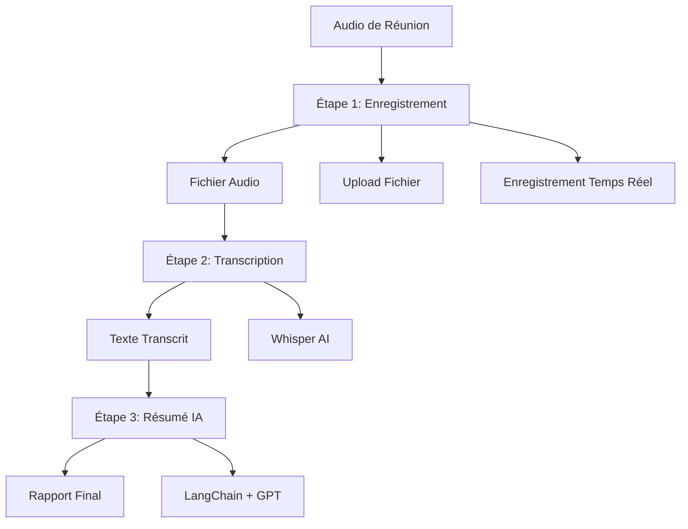

# 📋 Logique de l'Application Meeting Reports Generator

## 🎯 Vue d'Ensemble

L'application Meeting Reports Generator suit un processus structuré en **3 étapes distinctes** pour transformer un enregistrement audio de réunion en rapport détaillé généré par l'IA.

---

## 📝 Les 3 Étapes du Processus

### **ÉTAPE 1 : ENREGISTREMENT DE LA RÉUNION** 🎤

#### **Objectif**
Capturer l'audio de la réunion de manière optimale pour une transcription de qualité.

#### **Méthodes Disponibles**
1. **Upload de Fichier Audio**
   - Formats supportés : WAV, MP3, M4A, WEBM, OGG
   - Taille maximale : 100MB
   - Glisser-déposer ou sélection de fichier

2. **Enregistrement en Temps Réel**
   - Utilisation du microphone du navigateur
   - Qualité audio optimisée (44.1kHz)
   - Fonctions pause/reprise/arrêt
   - Sauvegarde automatique en format WebM

#### **Interface Utilisateur**
- Zone de drop stylée avec animations
- Boutons de contrôle intuitifs
- Indicateurs de statut en temps réel
- Conseils pour une qualité optimale

#### **Validation**
- Vérification des permissions microphone
- Contrôle de la taille du fichier
- Validation du format audio

---

### **ÉTAPE 2 : TRANSCRIPTION DE LA RÉUNION** 📝

#### **Objectif**
Convertir l'audio en texte transcrit avec une précision maximale.

#### **Technologie Utilisée**
- **Whisper AI** (OpenAI) pour la transcription
- Modèle multilingue haute précision
- Traitement local pour la confidentialité

#### **Processus Automatique**
1. **Upload du fichier** vers le backend
2. **Démarrage de la transcription** via l'API Whisper
3. **Polling du statut** toutes les 2 secondes
4. **Affichage du progrès** en temps réel

#### **Interface Utilisateur**
- Barre de progression animée
- Messages de statut détaillés
- Indicateur visuel de l'étape active
- Gestion des erreurs en temps réel

#### **Résultat**
- Transcription complète en texte
- Horodatage des segments
- Détection automatique de la langue
- Précision optimisée pour le français

---

### **ÉTAPE 3 : RÉSUMÉ DE LA RÉUNION** 🤖

#### **Objectif**
Générer un rapport structuré et actionnable à partir de la transcription.

#### **Technologie Utilisée**
- **LangChain** pour l'orchestration IA
- **OpenAI GPT** pour la génération de contenu
- **Traitement intelligent** des données

#### **Contenu du Rapport Généré**
1. **Résumé Exécutif**
   - Points clés de la réunion
   - Décisions importantes
   - Contexte général

2. **Points d'Action**
   - Tâches assignées
   - Responsables identifiés
   - Échéances mentionnées

3. **Détails Techniques**
   - Transcription complète
   - Métadonnées (durée, participants, etc.)
   - Timestamps des moments importants

#### **Interface Utilisateur**
- Affichage du rapport structuré
- Options d'export (PDF, texte)
- Navigation dans les sections
- Partage et sauvegarde

---

## 🔄 Flux de Données



## 🎨 Interface Utilisateur

### **Indicateur de Progression**
- **Barre des 3 étapes** avec numérotation claire
- **États visuels** : En attente, En cours, Terminé
- **Animations** : Transitions fluides entre les étapes
- **Couleurs** : Bleu (en cours), Vert (terminé), Gris (en attente)

### **Messages de Statut**
- **Étape 1** : "Enregistrement en cours..." / "Fichier uploadé"
- **Étape 2** : "Transcription en cours..." / "Transcription terminée"
- **Étape 3** : "Génération du résumé..." / "Rapport généré !"

### **Gestion des Erreurs**
- **Messages clairs** pour chaque type d'erreur
- **Actions de récupération** proposées
- **Retour à l'étape précédente** si nécessaire

## ⚙️ Configuration Technique

### **Variables d'Environnement**
```bash
REACT_APP_API_URL=https://meeting-reports.iahome.fr/api
PORT=3001
HOST=0.0.0.0
```

### **Endpoints API**
- `POST /upload` : Upload du fichier audio
- `POST /process/{file_id}` : Démarrage du traitement
- `GET /status/{file_id}` : Vérification du statut
- `GET /reports` : Liste des rapports générés

### **États de l'Application**
```javascript
const [currentStep, setCurrentStep] = useState(1); // 1, 2, ou 3
const [processingStatus, setProcessingStatus] = useState('');
const [loading, setLoading] = useState(false);
const [error, setError] = useState(null);
```

## 🚀 Avantages de cette Approche

### **Clarté du Processus**
- L'utilisateur comprend exactement où il en est
- Chaque étape a un objectif précis
- Progression visuelle claire

### **Gestion d'Erreurs**
- Erreurs isolées par étape
- Possibilité de reprendre à une étape spécifique
- Messages d'erreur contextuels

### **Expérience Utilisateur**
- Interface intuitive et guidée
- Feedback en temps réel
- Animations engageantes

### **Maintenabilité**
- Code structuré par étapes
- Logique de traitement séparée
- Tests unitaires facilités

---

## 📊 Métriques de Succès

- **Taux de complétion** : % d'utilisateurs qui terminent les 3 étapes
- **Temps de traitement** : Durée moyenne par étape
- **Qualité de transcription** : Précision du texte généré
- **Satisfaction utilisateur** : Feedback sur l'interface

---

**🎯 Cette logique en 3 étapes garantit une expérience utilisateur claire, une gestion d'erreurs robuste et un processus de traitement optimisé pour la génération de rapports de réunions de qualité professionnelle.**
